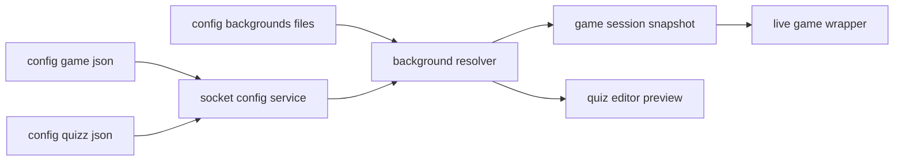
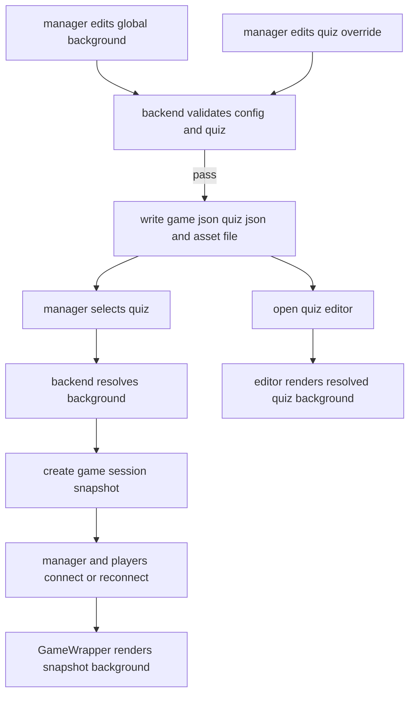

# Map Structure

Last Edited: 2026-06-26

## Representation contract

- Current phase goal: Define the persisted config shape, runtime ownership, and serving boundary for manager-controlled game backgrounds before implementation planning.
- Runtime surface: browser/client plus socket service/backend; boundaries are UI/input, network/socket, file/config storage, static asset serving, and game-session lifecycle.
- Preserved invariants:
  - `config/game.json` remains the instance-wide settings source.
  - `config/quizz/*.json` remains the quiz source of truth.
  - Quiz validation stays in the shared common validator before config writes.
  - Live games use a fixed quiz snapshot after `game:create`; no mid-session visual edits or sync.
  - Existing bundled `packages/web/src/assets/background.png` remains the final fallback.
- Non-goals / complexity avoided:
  - No theming system, logo customization, accent color model, or login-shell change in v1.
  - No external asset registry, CDN, database, plugin loader, or build-time asset replacement workflow.
  - No client-side authority over config paths or arbitrary filesystem reads.
  - No live visual update channel after a game is created.
- Representation acceptance signals:
  - A global default background can be represented in `game.json`.
  - A quiz can omit or provide one background override in its JSON.
  - The backend can validate and resolve `quiz override -> global default -> bundled fallback`.
  - A game session and quiz editor preview can inspect one resolved background value.
  - Config-local image files are referenced through stable public URLs, not through raw filesystem paths.

## Visual system map

Arrow meaning: data production

## Data and state ownership

| state | kind | source of truth | mutator / authority | persisted? | debug inspection point |
|---|---|---|---|---|---|
| global background reference | authored | `config/game.json` | manager-authenticated config write on backend | yes | inspect `config/game.json`; manager config payload |
| quiz background override | authored | `config/quizz/<id>.json` | manager-authenticated quiz save/update on backend | yes | inspect quiz JSON; `quizz:get` payload |
| uploaded background file | authored asset | config-local background asset folder | manager-authenticated upload/store boundary on backend | yes | inspect config asset folder and served URL |
| resolved background URL | derived | resolver output from quiz plus game config | backend resolver only | no | game create logs/payload; quiz editor payload |
| game session background | working snapshot | resolved value captured during `game:create` | `Game` instance constructor/start lifecycle | no | manager/player reconnect payloads and game status wrapper state |
| editor preview background | working derived state | loaded quiz plus manager config | quiz editor provider/page state | no | React devtools or `quizz:get` plus config state |
| bundled fallback background | authored build asset | `packages/web/src/assets/background.png` | source tree build | no config persistence | browser network panel/static import |

## Core shapes

Selected representation:

| shape | owner | fields | notes |
|---|---|---|---|
| `GameConfig` | common/backend config contract | `managerPassword`, optional `visuals.background` | Instance-wide default. Missing field is valid and means use bundled fallback unless quiz override exists. |
| `Quizz` | common quiz contract | existing fields plus optional `visuals.background` | Per-quiz override. Missing field inherits global default. |
| `BackgroundRef` | common visual contract | public URL or config asset id/path token | Stored values must be portable across the config folder and should not expose absolute host paths. |
| `ResolvedVisuals` | backend resolver output | `backgroundUrl` | Runtime/client-facing value. It is derived and should not be written back to quiz or game config. |
| `Game` session visual snapshot | socket service game instance | `visuals: ResolvedVisuals` | Captured when the game is created so reconnects and clients see the same background for the session. |

Validation boundary:

| input | validation owner | accepted meaning |
|---|---|---|
| global background edit | game config validator | optional background ref points to an allowed config asset or empty value |
| quiz background edit/import | quiz validator | optional override is a valid background ref or omitted |
| uploaded file | backend upload boundary | image type/size/name normalized before persistence |
| client runtime value | no authority | client receives a resolved URL only |

## Control flow and lifecycle

Arrow meaning: lifecycle order / control handoff

## Alternatives and decision

| option | source of truth | connection points | debuggability | performance/dependency cost | verdict |
|---|---|---|---|---|---|
| Config JSON refs plus config-local asset files | `game.json`, quiz JSON, config asset folder | manager config/quiz events, asset serving URL, game create resolver | High: inspect JSON, files, and resolved payloads | Low: reuses existing file-backed config and socket flow | Selected |
| Store base64 image data directly in JSON | `game.json` and quiz JSON | existing config/quiz writes only | Medium: one file contains all data but large diffs obscure config | High: bloats socket payloads and JSON reads | Rejected |
| External URL only | quiz/global URL strings | no file serving boundary | Medium: easy to inspect string, hard to ensure availability | Low app cost but high deployment fragility | Rejected for portability requirement |
| Replace bundled source asset | source tree asset | build/deploy only | Low for managers; requires repo edits/build | Low runtime, high workflow friction | Rejected by intent |
| Runtime CSS/theme store in client state | browser store | manager UI and game UI state | Low: duplicate authority and reconnect ambiguity | Medium: extra sync paths | Rejected for fixed-session requirement |

## Dependency and authority checks

- Circular dependencies: Avoided. Common defines data contracts, socket service validates/persists/resolves, web renders configured values. Web must not import backend config helpers; backend must not depend on web components.
- Duplicate authority/state: Avoided by treating persisted refs as authored state and resolved URLs as derived snapshots. The client cannot mutate resolved visuals directly.
- Boundary validation location: Backend validates writes before persisting `game.json`, quiz JSON, or files. Common validators should own JSON schema; backend storage boundary owns file safety.
- Hot-path concerns: Resolution happens on config load/editor load and game creation, not per frame or per status render. Game clients receive one string, so `GameWrapper` stays render-cheap.

## Plan inputs

- Decisions to promote into `plan.md`:
  - Add a small shared visual/background representation used by `GameConfig`, `Quizz`, manager payloads, and game-session payloads.
  - Persist authored refs in `config/game.json` and `config/quizz/*.json`; keep resolved background URLs derived.
  - Store uploaded images under a config-local asset folder and expose them through a stable public URL boundary.
  - Resolve backgrounds on the backend with precedence `quiz override -> global default -> bundled fallback`.
  - Capture resolved visuals when a `Game` is created and reuse that value for reconnects and rendering.
  - Extend quiz editor state so the preview can use the same resolved value for the current quiz.
- Open blockers:
  - None. Planning locked a manager-authenticated Socket.IO upload flow, a 5 MB decoded image cap, and a socket-owned `/config-assets/backgrounds/<file>` serving route proxied by nginx/Vite.
- Smallest proof point future implementation must cover:
  - With one global image and one quiz override in config storage, starting two games resolves different backgrounds while a quiz without override uses the global default.
- High-level verification ideas:
  - Validate imported quiz JSON with and without `visuals.background`.
  - Restart with config-local image files present and confirm manager/game views still load served URLs.
  - Inspect game creation and reconnect payloads to confirm they carry the same session background.
