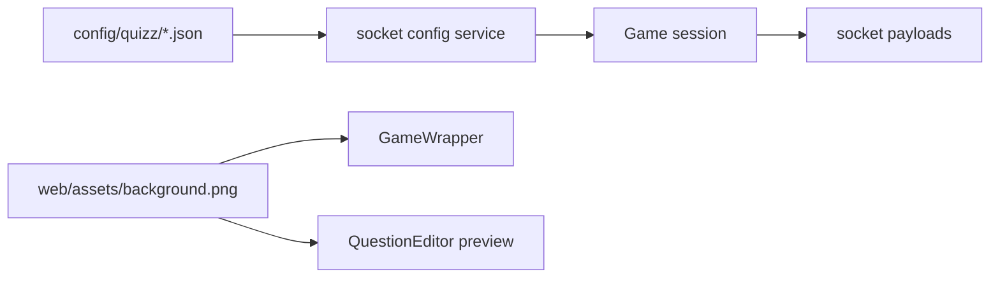
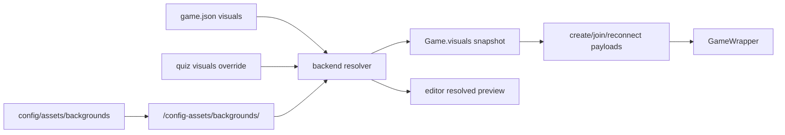

Last Edited: 2026-06-29

# Plan: Manager visual customization

## 1. Current state

**Baseline snapshot.** Bullets below describe the repository at task start. As of 2026-06-26, Phases 1–2 and the live-game portions of Phase 4 are implemented; Phase 3 (quiz override/editor preview) and Phase 5 docs remain. See `implementation.md` for as-built details.

| Phase | Status |
|---|---|
| Phase 1 — contracts, validation, asset serving | done |
| Phase 2 — manager global background authoring | done |
| Phase 3 — per-quiz override and editor preview | pending |
| Phase 4 — live game snapshot and rendering | partial — snapshot/join/reconnect/`GameWrapper` wired; manual precedence/reconnect proof pending |
| Phase 5 — final verification and docs | pending |

- `packages/socket/src/services/config.ts` owns file-backed config I/O under `config`, including `game.json`, `quizz/*.json`, and `results/*.json`. `game.json` currently has only socket-local `GameConfig.managerPassword`.
- `packages/common/src/validators/quizz.ts` and `packages/common/src/types/game/index.ts` define quiz JSON as `subject` plus `questions`; no quiz-level visual field exists.
- `packages/common/src/types/manager.ts` defines `ManagerConfig` as quiz/result metadata only. `packages/socket/src/services/manager.ts:emitConfig` does not expose game settings.
- `packages/web/src/features/game/components/GameWrapper.tsx` and `packages/web/src/features/quizz/components/QuestionEditor/index.tsx` import bundled `packages/web/src/assets/background.png` directly.
- `packages/socket/src/services/game/index.ts` creates an in-memory `Game` from a quiz snapshot. `GAME_CREATED`, manager reconnect, and player reconnect payloads omit session visual state.
- Docker serves only `/app/web` and proxies `/ws`; `CONFIG_PATH=/app/config` is private to the socket process. Config image files are not publicly reachable today.

## 2. Target shape

- Add a small shared visual contract for authored background refs and resolved runtime visuals.
- Store the global default background ref in `config/game.json` as `visuals.background`.
- Store optional per-quiz override in `config/quizz/*.json` as `visuals.background`.
- Store uploaded/background files under `config/assets/backgrounds/` and expose them through a socket-owned narrow HTTP route at `/config-assets/backgrounds/<file>`. Docker nginx and Vite dev proxy that prefix to the socket process so dev and production share one URL shape.
- Resolve background on the backend with precedence `quiz override -> global default -> bundled fallback`.
- Capture `ResolvedVisuals` when `Game` is constructed and include the same `backgroundUrl` in game creation, first-join, and reconnect payloads.
- Update `GameWrapper` and `QuestionEditor` to render a passed/resolved URL, falling back to the bundled asset when no URL is provided.

## 3. Contract

### Behavior

- Managers can set or clear one global default background image from manager setup, persisted in `game.json`.
- Managers can set or clear one per-quiz background override from the quiz editor, persisted in that quiz JSON.
- Live manager and player game views render the resolved background: quiz override, then global default, then bundled fallback.
- A live game keeps the background resolved at creation time across status changes and reconnects.
- The quiz editor preview renders the resolved background for the quiz being edited without changing per-question media behavior.

### Domain language

- Canonical/inferred terms: `global default`, `per-quiz override`, `resolved background`, `config asset`, `game session visual snapshot`.
- Bounded contexts: manager setup, quiz editor, live game, config storage.
- Glossary conflict: `QuestionEditorMedia` is question media only; do not reuse it for quiz background.

### Non-goals

- No logo, accent color, login shell, or broad theme system in v1.
- No mid-session visual update channel.
- No external CDN, database, or build-time source asset replacement workflow.
- No exposure of the whole config directory over HTTP.

### Acceptance checks

| check | proof method | required evidence |
|---|---|---|
| Global default can be set, read back, and cleared | manual manager setup plus config inspection | `config/game.json` changes and manager reload shows current value |
| Per-quiz override can be set, read back, and cleared | manual quiz editor plus config inspection | target quiz JSON changes and editor reload shows current value |
| Resolution precedence works | manual start games with override/no override/no global | screenshots or network/payload evidence for three backgrounds |
| Session background is fixed | change config after game creation, reconnect | reconnect payload still contains original `backgroundUrl` |
| Config assets survive restart | restart server/container with same config dir | served image URL still loads and UI renders it |
| Quiz editor preview uses resolved background | manual editor matrix | `QUIZZ.DATA` includes backend `resolvedVisuals`; saved preview matches override/global/fallback cases, and an unsaved upload previews from the `BACKGROUND_ASSET_UPLOAD` ack `url` |
| Fresh player join shows session background | manual join without refresh | `GAME.SUCCESS_JOIN` payload includes `visuals`; waiting room renders background before reconnect |
| Config directory is not broadly exposed | manual HTTP probe | scoped asset URL returns 200; `game.json`, `quizz/`, and `results/` return 403/404 |
| Upload/set/clear success reflects persisted config | code review plus manual UI | success toast only after the server acks a persisted `game.json` mutation; failed set after upload removes the just-written asset best-effort |
| Type contracts stay aligned | automated type/build checks | `pnpm -r run types`; `pnpm build` |

### Unverified change control

- Intended change batch size: one vertical slice at a time, with type checks or manual inspection after each slice.
- Checkpoint cadence: close each slice only after its acceptance proof is possible without relying on later UI polish.
- Rollback/recovery point: JSON schema changes remain optional and backward-compatible; remove `visuals` fields and config asset refs to return to bundled fallback.
- Refactor/cleanup separation: avoid unrelated route, styling, or manager shell refactors; keep generated route churn isolated if the router requires it.

### Risk profile

- Correctness: highest risk is split authority between frontend state and backend config. Mitigation: backend owns persisted refs and runtime resolution.
- Performance: low risk; resolving one URL on editor load/game creation is not hot-path work.
- External integration / boundary I/O: medium risk around serving config assets without leaking `game.json` or results.
- User/data impact: existing quizzes and `game.json` without `visuals` must continue to load and fall back cleanly.

## 4. Data / API shape

- Add common visual types, preferably in a new file such as `packages/common/src/types/visuals.ts`:
  - `BackgroundRef = { kind: "config-asset"; path: string }`
  - `VisualsConfig = { background?: BackgroundRef }`
  - `ResolvedVisuals = { backgroundUrl?: string }`
- `BackgroundRef.path` is a portable path token relative to `config/assets/backgrounds/`, for example `abc123.webp`. It must not contain absolute paths, URL origins, `..`, path separators outside the normalized asset namespace, or the public `/config-assets` prefix.
- `ResolvedVisuals.backgroundUrl` is the only public browser URL and is derived by the backend resolver. It is optional; absence means the web client uses the bundled `background.png` import.
- Extend quiz schema/type with `visuals?: VisualsConfig` on `Quizz` and `QuizzWithId`.
- Promote game config validation into common as `{ managerPassword: string; visuals?: VisualsConfig }`; missing `visuals` is valid.
- Extend `ManagerConfig` to include current game visuals and resolved global preview data.
- Extend game socket payloads:
  - `MANAGER.GAME_CREATED`: add `visuals: ResolvedVisuals`.
  - `MANAGER.SUCCESS_RECONNECT` and `PLAYER.SUCCESS_RECONNECT`: add `visuals: ResolvedVisuals`.
  - `GAME.SUCCESS_JOIN`: change from raw `gameId: string` to `{ gameId: string; visuals: ResolvedVisuals }` so first-time players render the waiting room background without relying on reconnect.
  - `QUIZZ.DATA`: change from raw `QuizzWithId` to `{ quizz: QuizzWithId; resolvedVisuals: ResolvedVisuals }` or an equivalent typed payload; the editor must receive backend-resolved preview data.

### Socket event contract

| event | auth | request | success response | notes |
|---|---|---|---|---|
| `MANAGER.BACKGROUND_UPLOAD` (global upload-and-set) | manager | `{ fileName: string; mimeType: string; dataBase64: string }` | `{ ref: BackgroundRef; url: string }` | Validates type/size/name, writes unique file under `config/assets/backgrounds/`, **then persists it as the global default** `game.json.visuals.background`, then acks; deletes the new file best-effort if persistence fails. Treat ack callback as optional at the socket boundary. This event is global-scoped only and must not be reused for per-quiz overrides. |
| `MANAGER.BACKGROUND_ASSET_UPLOAD` (scope-neutral, **no config write**) | manager | `{ fileName: string; mimeType: string; dataBase64: string }` | `{ ref: BackgroundRef; url: string }` | Stores the asset via the existing `storeBackgroundAsset` helper and acks `{ ref, url }` **without writing any `game.json` or quiz JSON**. This is the upload path Phase 3 uses: the returned `ref` is carried into `QUIZZ.SAVE`/`QUIZZ.UPDATE`, and the returned `url` drives the editor preview of the still-unsaved override. Ack callback optional, same boundary guard as the global event. Unreferenced assets uploaded but never saved are accepted debt for v1 (see §11). |
| `MANAGER.GLOBAL_BACKGROUND_SET` | manager | `{ background: BackgroundRef }` | updated `ManagerConfig` or existing `MANAGER.CONFIG` refresh | Writes `game.json.visuals.background`; ack persisted success/failure. Kept for a future ref-picker UI; not used by the v1 upload flow, which sets global through `MANAGER.BACKGROUND_UPLOAD`. |
| `MANAGER.GLOBAL_BACKGROUND_CLEAR` | manager | none | updated `ManagerConfig` or existing `MANAGER.CONFIG` refresh | Removes global background ref; ack persisted success/failure. |
| `QUIZZ.SAVE` / `QUIZZ.UPDATE` | manager | existing quiz payload plus `visuals?: VisualsConfig` | existing success/config refresh | Quiz override is persisted through the normal quiz save path. The override `ref` comes from a prior `MANAGER.BACKGROUND_ASSET_UPLOAD` ack (or is cleared by omitting `visuals.background`); do not add a separate quiz-background set/clear authority. |
| `QUIZZ.GET` -> `QUIZZ.DATA` | manager | existing quiz id | `{ quizz: QuizzWithId; resolvedVisuals: ResolvedVisuals }` | Server resolves the preview for the **persisted** quiz plus current `game.json`; web must not build config-asset URLs. For an **unsaved** in-editor override, the editor previews using the `url` returned by `MANAGER.BACKGROUND_ASSET_UPLOAD` until the next save/reload re-resolves through `QUIZZ.DATA`. |
| `GAME.SUCCESS_JOIN` | player | join invite code flow | `{ gameId: string; visuals: ResolvedVisuals }` | Normal first-time join path for waiting room background. |

Upload limits are locked at 5 MB decoded image bytes for v1. Because base64 expands payload size, configure Socket.IO `maxHttpBufferSize` to at least **8 MB** (5 MB decoded image plus base64 overhead and metadata). Lower the v1 limit in both validator and docs before reducing the buffer.

## 5. Runtime / loader / UX behavior

- Entry points: manager setup (`packages/web/src/pages/manager/config.tsx`), quiz editor (`QuizzEditorProvider`, `QuizzEditorHeader`, `QuestionEditor`), game lifecycle (`handlers/game.ts`, `services/game/index.ts`, party pages, `GameWrapper`).
- Validation: JSON refs must point to the scoped background asset namespace; uploads reject path traversal, oversize files, and disallowed MIME/extension.
- Fallback: backend resolver returns no custom `backgroundUrl` when no valid ref exists; web components use bundled `background.png`.
- Cache/reload: use generated/content-addressed or otherwise unique filenames to avoid stale browser caches when replacing images.
- Diagnostics: manager-facing socket errors should say whether validation failed, upload failed, or a stored ref points to a missing file.

## 6. Dependencies and constraints

- No new runtime package is planned; use existing Node file APIs, Socket.IO, Zod, React, and lucide-react UI patterns.
- Docker/nginx must not expose all of `/app/config`. The selected serving boundary is a socket-owned HTTP route for `/config-assets/backgrounds/<file>` backed only by `config/assets/backgrounds/`; nginx proxies that prefix to the socket process, and Vite dev proxies the same prefix.
- Socket.IO upload is the preferred v1 direction because current backend public API is socket-only.
- `packages/socket/src/index.ts` currently constructs `new ServerIO()` without an HTTP request handler. Phase 1 must attach Socket.IO to a Node HTTP server so the same process can serve the narrow config-asset route and honor `maxHttpBufferSize`.
- `packages/web/src/route.gen.ts` is already dirty and unrelated; avoid touching it unless route generation is explicitly required by UI changes.
- Network access is restricted; verification should rely on local commands and local manual runs.

## 7. Authority and state ownership

- Single authority owner: socket config service and backend resolver.
- Decision point: background is resolved when serving editor data and when handling `game:create`.
- Source of truth: `config/game.json`, `config/quizz/*.json`, and scoped config asset files.
- Working state: quiz editor React state and manager/web stores.
- Derived/cache state: `ResolvedVisuals` in manager payloads, editor preview state, and `Game.visuals`.
- Persisted state: authored refs and asset files only; never persist resolved public URLs as authoritative data.
- Boundary readers/writers: manager-authenticated socket handlers write config; web reads/writes through typed socket events only; the socket public asset route reads scoped asset files, with nginx/Vite proxying only the public prefix.
- Dependency direction: common defines types/validators, socket persists/resolves, web renders; no web-to-socket implementation imports for config helpers.
- New dependencies and why they are not circular: none planned.

## 8. Proposed approach

### Phase 1: Contracts, config validation, and asset serving

- Execution mode: AFK
- Change: add shared visual data shapes, optional schema fields, config asset storage helper, backend resolver, socket-owned public asset route, nginx proxy, and Vite dev proxy.
- Files/symbols: `packages/common/src/types/game/index.ts`, `packages/common/src/validators/quizz.ts`, new common visual type file, common game config validator, `packages/socket/src/services/config.ts`, new `packages/socket/src/services/visuals.ts`, `packages/socket/src/index.ts`, `docker/nginx.conf`, `packages/web/vite.config.ts`.
- Authority rationale: schema and asset boundaries must exist before UI or game payloads can rely on them.
- Acceptance impact: existing config and quizzes still load; a known config asset ref resolves to a public URL.
- Independent proof / checkpoint: common/socket type checks; `/config-assets/backgrounds/<file>` returns the image; `/config-assets/../game.json`, `/game.json`, `/config-assets/quizz/`, and `/config-assets/results/` do not expose config.
- Tests included: type checks plus manual inspection; add focused helper tests only if a test harness is introduced.
- Unverified-change limit for this phase: common/socket/Docker only.
- Ordered implementation steps:
  1. Add `VisualsConfig`, `BackgroundRef`, and `ResolvedVisuals` shared types.
  2. Extend `quizzValidator` and quiz types with optional `visuals.background`.
  3. Promote/validate `GameConfig.visuals` through common without breaking existing `game.json`.
  4. Add `packages/socket/src/services/visuals.ts` for asset folder constants, safe path normalization, public URL generation, and `resolveVisuals`; handlers must not inline precedence or URL construction.
  5. Change `packages/socket/src/index.ts` to attach Socket.IO to an HTTP server with `maxHttpBufferSize` set to at least 8 MB for 5 MB decoded uploads plus base64 overhead.
  6. Serve only `GET /config-assets/backgrounds/<file>` from `config/assets/backgrounds/`; reject traversal and non-file requests.
  7. Proxy `/config-assets/` to the socket process in `docker/nginx.conf` and `packages/web/vite.config.ts`.
  8. Run `pnpm --filter @razzia/common run types` and `pnpm --filter @razzia/socket run types`.

### Phase 2: Manager global background authoring

- Execution mode: AFK
- Change: expose global visuals in manager config, add manager-authenticated upload/set/clear flow, and update manager setup UI.
- Files/symbols: `packages/common/src/types/manager.ts`, `packages/socket/src/services/manager.ts`, manager socket handlers, `packages/web/src/pages/manager/config.tsx`, manager configuration components/store.
- Authority rationale: manager setup is the instance-wide authoring surface for `game.json`.
- Acceptance impact: manager can set, reload, and clear global default background.
- Independent proof / checkpoint: upload one asset, inspect `config/game.json`, reload manager config and confirm the same ref/resolved preview appears.
- Tests included: type checks and manual UI check.
- Unverified-change limit for this phase: global settings only.
- Ordered implementation steps:
  1. Extend `ManagerConfig` with game visuals and resolved visuals.
  2. Extend `emitConfig` to include current game visuals and resolved global fallback.
  3. Add manager-authenticated socket event(s) from the §4 contract to upload/store background assets and set/clear `game.json.visuals.background`.
  4. Implement upload lifecycle as validate -> write unique asset file -> update JSON when set is requested -> emit refreshed config; if JSON update fails after writing a new file, delete it best-effort.
  5. Add manager setup UI control with preview, upload and clear states (no asset picker in v1), and error feedback.
  6. Update manager store types and config page listeners.
  7. Run web/common/socket type checks and manually inspect persisted `game.json`.

### Phase 3: Per-quiz override and editor preview

- Execution mode: AFK
- Change: preserve/edit `Quizz.visuals.background`, add a scope-neutral `MANAGER.BACKGROUND_ASSET_UPLOAD` event, add quiz-level background UI, and render `QuestionEditor` with the resolved quiz background.
- Files/symbols: `QuizzEditorProvider`, `QuizzEditorContextType`, `QuizzEditorHeader`, `packages/web/src/pages/manager/quizz/layout.tsx`, quiz routes, `QuestionEditor`, quiz socket get/save/update handlers, `packages/socket/src/handlers/manager.ts` (new asset-upload-only handler reusing `storeBackgroundAsset`), `packages/common/src/types/manager.ts` and event constants.
- Authority rationale: quiz editor owns unsaved quiz working state; backend validator owns persisted quiz JSON.
- Acceptance impact: one quiz can override background while another inherits global default; editing a quiz does not drop existing visuals.
- Independent proof / checkpoint: set override on quiz A, leave quiz B empty, reload both editors and inspect respective JSON.
- Tests included: type checks; manual save/reload proof.
- Unverified-change limit for this phase: quiz editor and quiz persistence only.
- Ordered implementation steps:
  1. Add `visuals` to quiz editor provider initial state and actions, preserving any loaded `visuals.background` so editing/saving never drops it.
  2. Include `visuals` in save/update payloads from `QuizzEditorHeader`.
  3. Add a `MANAGER.BACKGROUND_ASSET_UPLOAD` handler that calls `storeBackgroundAsset` and acks `{ ref, url }` **without** writing `game.json` or quiz JSON; reuse the existing boundary guard (optional callback, best-effort cleanup on failure). Do **not** reuse `MANAGER.BACKGROUND_UPLOAD`, which would overwrite the global default.
  4. Add quiz-level background upload + clear UI (no asset picker in v1), separate from per-question media. Upload calls `BACKGROUND_ASSET_UPLOAD`, stores the returned `ref` in editor state, and uses the returned `url` for the unsaved-override preview; clear removes `visuals.background` from editor state.
  5. Extend `QUIZZ.DATA` to include backend `resolvedVisuals` from `services/visuals.ts` for the persisted quiz; web must not construct public URLs from refs. Unsaved overrides are previewed only from the `BACKGROUND_ASSET_UPLOAD` ack `url` until the next save/reload.
  6. Pass the effective preview URL (unsaved upload `url`, else backend `resolvedVisuals.backgroundUrl`) to `QuestionEditor`; keep bundled fallback inside the component.
  7. Run web/common/socket type checks and manually verify that saving a quiz with and without an override neither drops nor clobbers global `game.json.visuals.background`.

### Phase 4: Live game snapshot and reconnect rendering

- Execution mode: AFK
- Change: resolve visuals during `game:create`, store them on `Game`, send them through creation/reconnect/join payloads, and render `GameWrapper` from socket-derived state.
- Files/symbols: `packages/socket/src/handlers/game.ts`, `packages/socket/src/services/game/index.ts`, `packages/socket/src/services/game/player-manager.ts`, `packages/common/src/types/game/socket.ts`, `packages/web/src/features/game/components/join/Username.tsx`, `packages/web/src/pages/manager/config.tsx`, player/manager Zustand stores, party pages, `GameWrapper`.
- Authority rationale: the live `Game` instance is the fixed session snapshot owner.
- Acceptance impact: live games use correct precedence and reconnect keeps the original session background.
- Independent proof / checkpoint: run the three-game precedence matrix (override, global-only, bundled fallback); fresh player join shows the waiting room background before refresh; reconnect manager/player and inspect unchanged `visuals.backgroundUrl`.
- Tests included: type checks; manual live game scenario.
- Unverified-change limit for this phase: game lifecycle and rendering only.
- Ordered implementation steps:
  1. Extend shared socket payload types for game creation, `GAME.SUCCESS_JOIN`, and manager/player reconnect visuals.
  2. Resolve visuals in the game create handler from selected quiz plus current game config.
  3. Store `visuals` on `Game` and include it in `GAME_CREATED`, `SUCCESS_JOIN`, and manager/player reconnect payloads.
  4. Add visual state to manager/player stores or page-local state.
  5. Change `GameWrapper` to accept optional `backgroundUrl` prop and fall back to bundled asset.
  6. Wire party manager/player pages to pass the snapshot background.
  7. Run `pnpm -r run types`; manually verify creation, status, and reconnect.

### Phase 5: Final verification and docs

- Execution mode: AFK
- Change: run full checks, document config asset workflow, and update task evidence.
- Files/symbols: `README.md`, task `progress.md`, optional `verify.json` only if workflow verifier needs project-owned commands.
- Authority rationale: maintainers need to know the new source of truth and operational storage path.
- Acceptance impact: all acceptance checks have collected evidence.
- Independent proof / checkpoint: full type/build passes and manual scenarios recorded in `progress.md`.
- Tests included: `pnpm -r run types`, `pnpm build`, workflow verifier.
- Unverified-change limit for this phase: docs/check evidence only.
- Ordered implementation steps:
  1. Update README config documentation with global/quiz visuals and asset folder notes.
  2. Run `pnpm -r run types`.
  3. Run `pnpm build`.
  4. Run workflow verifier for `.workflow/tasks/0001-manager-visual-customization`.
  5. Record evidence in `progress.md`.

### Complexity intentionally avoided

- No general theme object beyond background visuals.
- No live sync or status-broadcast visual changes after session creation.
- No public serving route for arbitrary config files.

## 9. Migration

- Existing `config/game.json` without `visuals` remains valid and resolves to bundled fallback.
- Existing quiz JSON without `visuals` remains valid and inherits global default or fallback.
- Existing bundled `packages/web/src/assets/background.png` remains the last fallback and keeps current behavior for users who never configure visuals.
- Avoid rewriting all quiz JSON during startup; write `visuals` only when users edit/save a background or quiz.
- Existing socket payloads keep current fields and add visual fields in coordinated common/socket/web changes.
- The repo currently ignores `/config`; custom backgrounds are config-volume-portable by default, not git-portable unless a team deliberately force-adds config files or changes ignore rules. README should make that distinction explicit.

## 10. Impacted surfaces

- Browser/client: manager setup UI, quiz editor provider/header/preview, party manager/player pages, `GameWrapper`, stores.
- Service/backend: config service, manager/quizz/game socket handlers, game session lifecycle, asset storage/serving.
- Build/deploy: Docker/nginx or socket HTTP serving for scoped config assets.
- Config/assets/schemas: `game.json`, `quizz/*.json`, `config/assets/backgrounds/`, common Zod validators and TS types.
- Docs: README config/deployment notes.

## 11. Edge cases and failure modes

| case | hazard type | intended failure mode | user-visible effect | proof |
|---|---|---|---|---|
| Missing `visuals` in old config/quiz | version drift | accept and fall back | current background remains | load old sample config |
| Ref points outside asset folder | boundary I/O | reject write or ignore invalid stored ref | manager error or fallback | path traversal probe |
| Asset file deleted after JSON save | boundary I/O | resolver returns fallback and warning/log | fallback background | delete asset then reload |
| Config changes after game start | lifecycle/order | existing `Game.visuals` unchanged | reconnect still uses old background | manual reconnect scenario |
| Static route too broad | data exposure | route only scoped assets | no access to passwords/results | HTTP probe for `game.json` |
| Same filename replaced | cache/version drift | generated unique filename or content hash | new image appears after save | upload replacement scenario |
| Oversize/non-image upload | validation | reject before write | manager-visible error | upload invalid file |
| Quiz override uploaded via `BACKGROUND_ASSET_UPLOAD` but quiz never saved | storage debt | asset file remains unreferenced; no config points to it | none (invisible) | accepted v1 debt; a later cleanup pass may prune assets unreferenced by any `game.json`/quiz JSON |

## 12. Verification plan

### Acceptance trace

| acceptance check | planned proof | evidence to collect | status |
|---|---|---|---|
| Global default can be set/read/cleared | manual manager setup | UI screenshot/log plus `game.json` diff | planned |
| Per-quiz override can be set/read/cleared | manual quiz editor | UI screenshot/log plus quiz JSON diff | planned |
| Resolution precedence works | manual three-game matrix | payload/network evidence for override, global, fallback | planned |
| Session background fixed after start | manual config edit plus reconnect | creation and reconnect payloads with same `backgroundUrl` | planned |
| Fresh player join shows background | manual join without refresh | `SUCCESS_JOIN` payload and waiting room screenshot | planned |
| Quiz editor preview uses resolved background | manual editor matrix | `QUIZZ.DATA.resolvedVisuals` and editor screenshots | planned |
| Config asset survives restart | manual restart/container reload | asset URL loads after restart | planned |
| Config directory is not broadly exposed | manual HTTP probe | asset URL 200; `game.json`/results not accessible | planned |
| Upload/set/clear success reflects persisted config | code review plus type/build | ack-gated toasts; upload-then-set failure cleans up asset | verified (global path) |
| Type/build contracts pass | automated commands | command output | planned |

### Automated checks

- `pnpm --filter @razzia/common run types`: expected pass after shared type/schema changes.
- `pnpm --filter @razzia/socket run types`: expected pass after backend/config/game changes.
- `pnpm --filter @razzia/web run types`: expected pass after UI/store changes.
- `pnpm -r run types`: expected pass before completion.
- `pnpm build`: expected pass before completion.
- Workflow verifier from the installed g-skills path used by the current agent environment: expected pass.

### Manual checks

- Set global background, reload manager setup, confirm preview and `game.json`.
- Set quiz override on one quiz, leave another unset, confirm editor preview and quiz JSON for both.
- Start game with override, game with only global, and game with neither; confirm visual precedence.
- Capture WebSocket frames in browser DevTools for `GAME_CREATED`, `GAME.SUCCESS_JOIN`, and manager/player `SUCCESS_RECONNECT`; record the relevant `visuals.backgroundUrl` values in `progress.md`.
- Reconnect manager/player to an existing game after changing config; confirm session background stays fixed.
- Restart local server/container with the same config folder; confirm custom asset URL still renders.
- Try to access `/config-assets/backgrounds/<file>` and negative probes such as `/game.json`, `/config-assets/../game.json`, `/config-assets/quizz/`, and `/config-assets/results/`; confirm only the scoped asset is exposed.

### Not verified by this plan

- Cross-browser visual QA beyond the manual browser used during implementation.
- Large image optimization or CDN behavior; v1 intentionally uses local config assets.

## 13. Documentation notes

- Update `README.md` to document `game.json.visuals.background`, quiz `visuals.background`, and the config asset folder.
- Document that background refs are portable config asset refs, not absolute filesystem paths.
- Document that live games snapshot visuals at creation and do not update mid-session.
- Note accepted image types/size limits once implementation locks exact values.
- Keep `intent.md`, `survey.md`, and `map-structure.md` as supporting context for user scope, code anchors, and authority rationale; `plan.md` is the canonical implementation contract.
- Keep `implementation.md` as the as-built record for completed slices and deviations from phased wording.
- Note `/config` gitignore behavior: config assets travel with the config volume or copied config directory, but are not committed by default.

## 14. Open questions / missing info

| question | decision blocked | risk if guessed | owner |
|---|---|---|---|
| Should teams make config assets git-portable by changing `.gitignore`, or keep the current volume/copy workflow? | documentation/ops convention only | low; current plan documents volume portability | user/maintainer |
