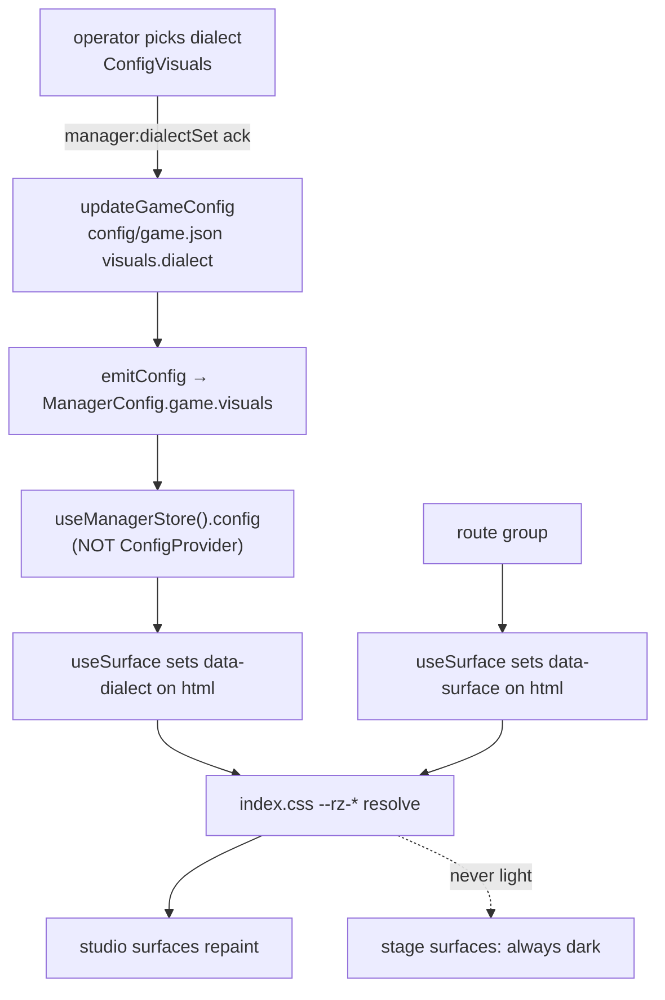

Last Edited: 2026-07-31

# Plan: Razzia UI design-language port (slide-gen dark-technical register)

Companions: [`survey.md`](survey.md) (recon, flows, risks R1–R10), [`deep-dive.md`](deep-dive.md) (options O1–O21, composites S1–S4).
Supersedes `.workflow/tasks/0001-manager-visual-customization` (decision D4).

## 1. Current state

**Evidence-backed facts**

- The entire theme is 5 lines: `packages/web/src/index.css:3-7` — `--color-primary: #ff9900`, `--color-secondary: #1a140b`, `--font-display: "Rubik Variable"`. Tailwind v4, single `@theme` block, no `tailwind.config`, no PostCSS config, no CSS modules.
- The app canvas is applied imperatively: `pages/__root.tsx` does `document.body.classList.add("bg-secondary")` and wraps `<Outlet/>` in `bg-secondary antialiased`.
- Blast radius census over `packages/web/src`: 73 `.tsx` files; 27 `bg-white`, 26 `bg-gray-200`, 47 `text-white`, 47 `font-bold`, 31 `drop-shadow*`, 15 `bg-primary`.
- The **host-photo layer stack is duplicated twice**, independently: `features/game/components/GameWrapper.tsx:65-71` (fixed full-bleed ``) and `features/quizz/components/QuestionEditor/index.tsx:18-22` (the same `` markup, separately written). `components/Background.tsx` is a **different, decorative** shell — two rotated `bg-primary/15` blocks, **no host image at all**. All three are shells that will migrate onto `<Atmosphere>`, but `<Atmosphere>` must therefore support two recipes, not one: a *photo* recipe and an *ambient* recipe.
- Route groups are already split the way the dialect needs: `pages/(auth)/**` + `pages/party/**` are play surfaces; `pages/manager/**` are authoring surfaces. `pages/manager/config.tsx` currently reuses the dark `Background` shell; `pages/manager/quizz/**` uses light `bg-gray-50` chrome. The register boundary already exists — it is just inconsistent.
- Task 0001 built a complete authored-vs-resolved visuals pipeline: `VisualsConfig` (`common/types/visuals.ts`, all members optional) → persisted in `config/game.json` / quiz JSON → `resolveVisuals` (`socket/services/visuals.ts`) → `ResolvedVisuals { backgroundUrl? }` → frozen on `Game.visuals` at construction → replayed on join/reconnect.
- `MANAGER.GLOBAL_BACKGROUND_SET` in `socket/handlers/manager.ts` is the acknowledged-mutation precedent: `manager.withAuth(socket, (payload, cb) => { validate → updateGameConfig → emitConfig → cb({ok:true}) })`.
- Zero tests workspace-wide. `pnpm -r run types` and `pnpm build` (plus root `pnpm lint` = types + oxlint) are the only automated gates. `workflow-verify` passes vacuously for this repo.
- 11 game-state **screen components** exist under `features/game/components/states/`, reachable **only** by playing a real game with real players. Note the arithmetic: `STATUS` has 10 keys and `GAME_STATE_COMPONENTS_MANAGER` has 10 entries, because it spreads the player map and then *overrides* `FINISHED` → `Podium`. Iterating the manager map alone therefore renders 10 of the 11 components and silently omits `PlayerFinished`.
- Task 0001 shipped its i18n keys to `en`/`es`/`it` only; `de`, `fr`, `ja` render raw key strings on the Visuals tab today.
- Fonts must be self-hosted (offline Docker deploy). `@fontsource-variable/rubik` imported at `main.tsx:1`. slide-gen's `fonts.css` uses a Google Fonts CDN `@import` and is unusable here.

**Owner files/symbols**

| concern | owner |
|---|---|
| theme values | `packages/web/src/index.css` `@theme` |
| app canvas / root chrome | `pages/__root.tsx` `GameLayout` |
| play-surface shell | `features/game/components/GameWrapper.tsx` |
| auth/config shell | `components/Background.tsx` |
| editor preview shell | `features/quizz/components/QuestionEditor/index.tsx` |
| status → screen contract | `features/game/utils/constants.ts` |
| authored visual config | `common/types/visuals.ts` + `common/validators/visuals.ts` |
| config file I/O | `socket/services/config.ts` |
| manager config assembly | `socket/services/manager.ts` `emitConfig` |
| manager mutations | `socket/handlers/manager.ts` (all `withAuth`) |
| client-side `ManagerConfig` | `features/game/stores/manager.tsx` `useManagerStore().config` — **the only live source**. `features/manager/contexts/config-context.tsx` (`ConfigProvider`/`useConfig`) wraps *only* `configurations/index.tsx:57`, so `useConfig()` anywhere else returns the default empty context and never sees a dialect. |

**Current data/control flow** — see `survey.md` Flows 1–5. Flow 1 (dialect) does not exist yet.

**Public behavior/API to preserve**

- `STATUS` union, `GAME_STATE_COMPONENTS`, `GAME_STATE_COMPONENTS_MANAGER`, `MANAGER_SKIP_BTN`, `MANAGER_SKIP_EVENTS` — the layout contract.
- `resolveVisuals` precedence `quiz override → global default`; resolution happens exactly once per game at creation; reconnects replay the frozen snapshot. The third tier — the **bundled fallback is client-side**: `resolveVisuals` returns `{}` when neither is set, and the web shells apply `backgroundUrl ?? background` themselves.
- Web never constructs config-asset URLs.
- The two-upload-event split (`BACKGROUND_UPLOAD` persists; `BACKGROUND_ASSET_UPLOAD` stores only).
- Only `GET /config-assets/backgrounds/<file>` is publicly served.
- All user-visible copy goes through `react-i18next`, 6 locales × 5 namespaces.
- Answer identity stays four-way distinguishable under colour-vision deficiency.

**Limitations motivating the change**

- The current palette (saturated orange on near-black, white cards, `bg-gray-200`), Rubik's rounded geometry, overshoot/bounce keyframes, and hard offset `box-shadow` read as an elementary-school game.
- Five theme lines cannot express accent triples, inset bloom, density registers, or a radius scale, so there is nowhere to put the target language.
- 31 neutral `drop-shadow*` occurrences are load-bearing for text legibility over an arbitrary host-uploaded photo — and neutral drop shadows are the source system's explicitly named #1 off-system tell. This is the central blocker.
- **Where those shadows actually live matters**, and it is not where a shell-level gate would look. Verified inventory: `Background.tsx`, `GameWrapper.tsx`, and `QuestionEditor/index.tsx` have **zero** `drop-shadow` between them. All 31 sit on content across 14 files — `Podium.tsx` 8, `Leaderboard.tsx` 4, `Result.tsx` 3, `Room.tsx` 3, `PlayerFinished.tsx`/`Responses.tsx`/`Start.tsx` 2 each, and one each in `AnswerButton.tsx`, `Answers.tsx`, `Prepared.tsx`, `Question.tsx`, `Wait.tsx`, `QuestionEditorAnswers.tsx`, `(auth)/layout.tsx`. Any acceptance gate scoped to the shells is therefore vacuous.

## 2. Target shape

**Desired end state**

One design language with a **dialect-independent role table**. Components reference *roles* (`brand`, `success`, `danger`, `info`, `warning`, `sequence`, `canvas`, `surface`, `panel`, `border`, text ramp, `answer-a…d`), never dialect-specific values. Two attributes on `document.documentElement` resolve roles to values:

- `data-surface="stage" | "studio"` — set by route group; *what kind of surface this is*.
- `data-dialect="dark-everywhere" | "stage-studio"` — the operator's persisted choice.

Effective register: light values only when `data-surface="studio"` **and** `data-dialect="stage-studio"`; dark slide-dialect values otherwise. Play surfaces are dark in every dialect.

**New/changed/deleted files**

| file | change |
|---|---|
| `packages/web/src/index.css` | rewritten: role-named `@theme` bound to `--rz-*` custom properties, one `[data-dialect][data-surface]` override block, calm motion + depth tokens. Legacy `--color-primary`/`--color-secondary` retained until Slice 6, then deleted. |
| `packages/web/STYLE.md` | **new** — the Razzia adherence doc: role table, two-namespace rule, scrim contract, banned patterns, migration status per directory. |
| `packages/web/src/components/Atmosphere.tsx` | **new** — the single owner of background layering, with **two recipes**: `photo` (canvas → host image → scrim → vignette) for `GameWrapper` + `QuestionEditor`, and `ambient` (canvas → role-tinted blocks → vignette, no host image) for `Background`. One component, one scrim token, two compositions. |
| `packages/web/src/hooks/use-surface.ts` | **new** — sets `data-surface` / `data-dialect` on `document.documentElement`. |
| `packages/web/src/pages/dev/gallery.tsx` | **new**, DEV-only — renders every game state, both dialects, the role table, and a type specimen. |
| `packages/common/src/types/visuals.ts` | `Dialect`, `DEFAULT_DIALECT`, `GameVisualsConfig` (background + dialect) split from `VisualsConfig` (background only) |
| `packages/common/src/validators/visuals.ts` | `dialectValidator`; new `gameVisualsConfigValidator`; `visualsConfigValidator` left background-only |
| `packages/common/src/validators/quizz.ts` | unchanged on purpose — line 28 keeps `visualsConfigValidator`, which now *cannot* express a dialect |
| `packages/common/src/validators/game-config.ts` | `visuals` switches to `gameVisualsConfigValidator` |
| `packages/common/src/constants.ts` | `EVENTS.MANAGER.DIALECT_SET` |
| `packages/common/src/types/game/socket.ts` | typed signature for the new event |
| `packages/common/src/types/manager.ts` | `ManagerConfig.game.visuals` retyped `GameVisualsConfig` |
| `packages/socket/src/handlers/manager.ts` | new acknowledged-mutation handler beside `GLOBAL_BACKGROUND_SET` |
| `packages/web/src/features/manager/components/configurations/ConfigVisuals.tsx` | dialect selector |
| `packages/web/src/locales/*/manager.json`, `errors.json`, `quizz.json` | de/fr/ja `visuals` backfill + new dialect keys in all 6 |
| `components/Background.tsx`, `GameWrapper.tsx`, `QuestionEditor/index.tsx` | consume `<Atmosphere>` instead of hand-rolled layers — `Background` with the `ambient` recipe, the other two with `photo` |
| `packages/web/src/features/game/stores/manager.tsx` | read-only consumer: `useSurface` reads `config?.game.visuals?.dialect` from here |
| `README.md` | visuals config documentation (inherited 0001 Phase 5) |
| 73 `.tsx` under `packages/web/src` | class-level restyle, converted group by group |

**Ownership boundaries**

- The **role table is the contract**; per-dialect hex values are implementation. A component that writes a dialect-specific value is a defect.
- `packages/web/src/index.css` is the single style authority. No component-local `<style>`, no CSS modules, no new stylesheets.
- `<Atmosphere>` owns the entire background layer stack, in both its recipes. No shell composes its own layers after Slice 4.
- The dialect's **sole source of truth is `config/game.json`**. A quiz may not carry one: the type split makes that unrepresentable rather than merely discouraged.
- On the client, `useSurface` is the **only writer** of `data-surface` / `data-dialect`. Its only dialect input is `useManagerStore().config`.

**New/changed APIs or data**

- The authored visual config **splits into two shapes**: `VisualsConfig { background? }` (used by quizzes, unchanged) and `GameVisualsConfig extends VisualsConfig { dialect? }` (used by `game.json` only). Both are all-optional objects, so this is additive and non-breaking — existing `game.json` and quiz JSON files stay valid.
- One new socket event, `manager:dialectSet`, manager-authed and acknowledged.
- **No change to `ResolvedVisuals`, `Game.visuals`, or any player-facing payload.**

**Dependency direction**

Unchanged and acyclic: `common` ← `socket`, `common` ← `web`. The dialect rides the existing `ManagerConfig.game.visuals` payload; no new client→server read path.

**Compatibility path**

Additive spine first, consumers strangled group by group. Legacy `--color-primary`/`--color-secondary` remain resolvable throughout so unconverted files keep compiling and rendering; they are deleted only when the last consumer is converted (Slice 6), and that deletion is the mechanical proof that conversion is complete.



## 3. Contract

### Behavior

1. An authenticated manager can choose between **Dark everywhere** and **Stage & studio** on the manager Visuals tab; the choice persists in `config/game.json` and survives a socket-process restart and a browser cache clear.
2. Play surfaces — join, PIN entry, loading, and every in-game screen for both players and manager — render in the dark slide dialect regardless of the dialect setting. Players never observe a studio surface.
3. Text over a host-uploaded background meets WCAG AA at every text size **without any neutral drop shadow**, across a fixture set of four deliberately adversarial images, because `<Atmosphere>` composites a token-defined scrim between the image and content. This is a *fixture-sample* guarantee, not a universal one — see the residual-risk note under A4.
4. The quiz editor's background preview and the live game render an identical layer stack, because both consume `<Atmosphere>` with the same `photo` recipe and the same scrim token.
5. All dialect and visuals copy renders translated in all six locales, including de/fr/ja which are broken today.

### Domain language

**Canonical terms** (from `survey.md` glossary): `VisualsConfig` (authored, persisted), `ResolvedVisuals` (backend-derived, player-facing), `BackgroundRef`, resolved background, session visual snapshot, accent triple.

**New terms introduced by this task** — all defined in `packages/web/STYLE.md`:

- **Dialect** — the operator's choice of token register: `dark-everywhere` | `stage-studio`.
- **Stage** — play surfaces (`pages/(auth)/**`, `pages/party/**`, `features/game/**`). Dark in every dialect.
- **Studio** — authoring surfaces (`pages/manager/**`, `features/manager/**`, `features/quizz/**`). The only surfaces a dialect changes.
- **Role** — a semantic slot in the token table (`brand`, `success`, …). Components reference roles.
- **Accent triple** — the matched accent/border/tint row a role supplies in a given dialect. Accents are used as triples, never as a bare hue.
- **Scrim contract** — the guarantee that content over a host image sits above a token-defined opacity floor.

**Inferred meanings or conflicts**

- `stage-studio` deliberately *does not* mean "light mode". It means: studio surfaces adopt the Canvas light/slate dialect; stage surfaces do not change. Naming it `light` would invite exactly the wrong implementation.
- Conflict, resolved by rule: the source system has **one** colour namespace because slides never say "this is option B". Razzia needs two. `accent-*` roles carry *meaning* and may never encode identity; `answer-a…d` carry *identity* and may never encode meaning. Identity is always carried by ≥2 channels (mono letter badge + hue), never hue alone. (composite S4)
- `--font-display` currently names Rubik; after Slice 3 it names Space Grotesk. The token name is kept to avoid churn across `index.html` and every consumer.

### Non-goals

- Game flow, scoring, socket protocol semantics, and the `STATUS` state machine.
- The celebration subsystem (decision D3): confetti, `.spotlight` sweep, podium reveal beats and their 2000 ms SFX schedule, and the overshoot `anim-*` keyframes stay. Restyle *around* them where a direct role-token equivalent exists; do not re-time, remove, or refactor them.
- Any change to `resolveVisuals` precedence, the `Game.visuals` freeze, the two-upload-event split, or the `/config-assets` route.
- Adding Playwright, Vitest, or CI visual regression. Verification in this task is a DEV fixture route plus a manual screenshot matrix. (Recorded as a gap in §12.)
- Consuming `_ds_bundle.js`; the `Foundations-Assignment` print dialect as a source.
- Product decisions about whether party-game energy should exist at all.
- New product features beyond the dialect selector.
- **A per-player theme preference.** Considered and rejected (D9): it would put the theme on every player payload *and* introduce per-device persistence, making it more expensive than either option Q2 was weighing. Players get one look — the operator's.
- Growing the theme's surface area for its own sake. Standing constraint from the user: *"it's the content that matters, not the theme."* If a slice starts to balloon, cut it rather than extend it.

### Acceptance checks

| check | proof method | required evidence |
|---|---|---|
| A1 — Dialect persists across socket restart and cache clear | manual | `config/game.json` contains `visuals.dialect`; after `pnpm dev:socket` restart + hard reload + re-auth, the Visuals tab shows the same selection and `document.documentElement[data-dialect]` matches. Capture the success path too: the handler's `{ ok: true }` acknowledgement arrives and **no** error toast appears — a silent no-op and a success look identical without this. |
| A2 — Studio surfaces change with the dialect; stage surfaces never do | manual, DEV gallery + real routes | Screenshots of `/manager/config`, `/manager/quizz/$id`, `/`, `/party/$gameId` in both dialects. Studio pairs differ; **stage pairs show no perceptible difference under side-by-side comparison at 100% zoom, same viewport** (not a pixel-diff claim — screenshots are hand-captured and font rasterisation is not deterministic across runs). **Always dialect-A vs dialect-B captured at the same checkpoint**, never against historical goldens: by Slice 6 the fonts and `<Atmosphere>` have legitimately changed, so a comparison against Slice 2's screenshots would fail for the wrong reason. |
| A3 — The three shells stay free of local shadows (non-regression) | grep gate | `rg 'drop-shadow\|shadow-\[' packages/web/src/components/Background.tsx packages/web/src/features/game/components/GameWrapper.tsx packages/web/src/features/quizz/components/QuestionEditor/index.tsx` returns nothing. **Green today** — note the path is the `QuestionEditor/index.tsx` *file*, not the directory: its sibling `QuestionEditorAnswers.tsx` does carry a shadow, and greping the directory would make this gate red for a reason it is not about. It exists only to stop `<Atmosphere>` reintroducing a shell shadow, and proves nothing about legibility; A4 and A11 carry that. |
| A4 — AA contrast over the adversarial fixture set with shadows removed | X1 scrim ladder | Contrast-ratio readings for body, label, and answer text over the 4 named fixture images at the chosen scrim value; all ≥ 4.5:1 (≥ 3:1 for ≥24 px). **Tool**: the sampled-pixel method in §12 — worst-case background pixel under each text run, measured in DevTools' contrast inspector, not an average. **Residual risk**: a pathological upload outside the fixture envelope can still fall below AA; the scrim is a floor tuned on samples, not a proof over all images. |
| A5 — Editor preview matches the live game | manual | Same quiz screenshotted in `QuestionEditor` and in a live `SHOW_QUESTION`; both use `<Atmosphere recipe="photo">` with the same scrim token. **Setup must be controlled or the comparison is meaningless**: same resolved `backgroundUrl`, same viewport, same dialect/surface. **What must match**: layer order and the scrim/vignette token values. **What need not match**: glyphs, copy, and question chrome — the editor is not a pixel clone of the game, it is a predictor of its backdrop. |
| A6 — All six locales render translated visuals + dialect copy | manual + grep | Two grep passes, because they close at different slices: 0001's `visuals` block present in all 6 `manager.json` (Slice 0), and this task's `manager:visuals.dialect.*` + `errors:visuals.*` present in all 6 (Slice 2). Grep proves presence, not rendering — so also screenshot the Visuals tab in **de, fr, and ja** with no raw key strings. |
| A7 — Inherited 0001 acceptance matrix passes | manual, run **before** any restyle | Global upload/set/clear + reload; drag/drop; per-quiz override persisted in quiz JSON with `game.json` untouched; editor preview matrix (override/global/fallback); fresh join, reconnect, restart persistence. **Failure policy**: any failing row must be either fixed or waived in writing by the user (recorded in `progress.md`) before Slice 1 starts. A silent fail is a stop. |
| A8 — No regression in the layout contract | build gate | `pnpm lint` (types + oxlint) and `pnpm build` clean at every checkpoint; `MANAGER_SKIP_EVENTS`'s `satisfies` constraint unchanged |
| A9 — Every game state reachable without playing a real game | manual | DEV gallery renders all **11** state components — the 10 entries of `GAME_STATE_COMPONENTS_MANAGER` **plus `PlayerFinished`**, which that map shadows via its `FINISHED` → `Podium` override — in both dialects |
| A10 — Legacy theme identifiers fully retired | grep gate | `rg '(bg\|border\|outline\|from\|to\|via\|ring\|fill\|stroke)-(primary\|secondary)\b\|bg-white\|bg-gray-\|\[#[0-9a-fA-F]{3,8}\]' packages/web/src` returns nothing except the D3 exception list; `--color-primary`/`--color-secondary` deleted from `index.css` and the build still passes. **Deliberately excludes `text-primary`/`text-secondary`**: both strings are unused in the tree today and `text-primary` is a *role* name in the new table, so greping them would make the gate uncloseable by a correct conversion. The prefix list is explicit because `bg-primary` alone misses `border-primary`, `from-primary`, and raw hex — the false negatives that would let the gate pass on an unconverted tree. |
| A11 — Neutral drop shadows retired workspace-wide | grep gate | `rg 'drop-shadow' packages/web/src` returns nothing outside the D3-frozen celebration cluster; any surviving occurrence is listed with its D3 justification in `packages/web/STYLE.md`. This is the gate that actually proves Behavior #3 across the app. **D3 vs A10/A11 boundary**: D3 freezes the celebration cluster's *timing, keyframes, SFX schedule, and confetti* — it does **not** exempt its colour classes. `medalColor`, the `bg-primary` podium blocks, and similar move onto role tokens like anything else. Only depth/motion treatments whose removal would break the reveal may claim a D3 exception, and each must be named. |

### Unverified change control

- **Intended batch size**: one slice = one PR = one route group or one subsystem. Never more than one directory converted before a checkpoint.
- **Checkpoint cadence**: `pnpm lint && pnpm build` plus a gallery screenshot pass at the end of every slice. Slices 0, 2, 4 additionally require the manual evidence named in their acceptance rows before the next slice starts.
- **Rollback/resume point**: every slice is a separate commit on a branch off the current head. Slices 1–3 are additive (spine, selector, fonts) and revert cleanly. Slice 4 is the first slice that changes existing render output; it is the designated rollback anchor for the visual port.
- **Refactor/cleanup separation**: extracting `<Atmosphere>` (Slice 4) is a refactor and ships with **zero** intentional visual change to the layer stack *other than* the scrim; the scrim value and shadow removal land as a second commit within that slice so the diff is reviewable. The `Responses.tsx` music `useEffect` cluster and the misspelled icon names (`CricleCheck`, `CricleXmark`) are explicitly **not** touched.

### Risk profile

- **Correctness**: low for the backend (one optional field, one authed handler mirroring an existing one). Medium-high for the web restyle — no test suite, and `twMerge` override precedence changes silently when arbitrary values (`bg-[#E69F00]`) become named tokens (R10).
- **Performance**: two self-hosted variable fonts replace one. Bundle delta must be measured (`pnpm --filter web build`) against a phone-on-conference-wifi budget; if the delta exceeds ~120 KB compressed, subset or drop the mono weight range.
- **Boundary/external integration**: none new. No new dependency reaches the socket package; no new HTTP route; no new persistence boundary in the browser (see §7 design wall).
- **User/data impact**: a malformed `game.json` returns `{} as GameConfig`, so a persisted dialect silently reverts to default with only a console log (R4, inherited). Documented, not fixed here.

## 4. Data / API shape

**The authored visual config splits in two**

The dialect must be representable *only* in `game.json`. Today `packages/common/src/validators/quizz.ts:28` reuses `visualsConfigValidator` for a quiz's `visuals`, so simply adding `dialect` to that validator would make `config/quizz/<id>.json` a legal second home for an operator-scoped setting — a silent authority split, and exactly the kind of thing that gets discovered six months later when two quizzes disagree. The type split makes it **unrepresentable** rather than merely discouraged, which costs one interface and needs no runtime stripping.

```ts
// packages/common/src/types/visuals.ts
export type Dialect = "dark-everywhere" | "stage-studio"
export const DEFAULT_DIALECT: Dialect = "dark-everywhere"

/** Authored visuals a quiz may carry. Background only — no dialect, ever. */
export interface VisualsConfig {
  background?: BackgroundRef
}

/** Authored visuals `config/game.json` may carry. Superset. */
export interface GameVisualsConfig extends VisualsConfig {
  dialect?: Dialect
}
```

```ts
// packages/common/src/validators/visuals.ts
export const dialectValidator = z.enum(["dark-everywhere", "stage-studio"])

// unchanged — still what validators/quizz.ts:28 consumes
export const visualsConfigValidator = z.object({
  background: backgroundRefValidator.optional(),
})

// game.json only
export const gameVisualsConfigValidator = visualsConfigValidator.extend({
  dialect: dialectValidator.catch(DEFAULT_DIALECT).optional(),
})
```

- **Required/optional**: `dialect` is optional everywhere; **absent means `DEFAULT_DIALECT`**. Note the Zod semantics precisely, because the naive spelling is wrong: `.catch()` rescues an *invalid* value, it does **not** supply a default for an *absent* one — an absent optional field stays `undefined` no matter what `.catch` says. So the two cases are handled in two different places and both are needed:
  - **invalid** (`"neon"` in the file) → `.catch(DEFAULT_DIALECT)` on the field, so a bad dialect degrades alone instead of failing `gameConfigValidator` and triggering the whole-config `{} as GameConfig` degradation (R4).
  - **absent** (no key at all) → resolved at the single read site, `useSurface`, via `?? DEFAULT_DIALECT`.
  `DEFAULT_DIALECT` is exported once from `common` and imported by both; do not restate the literal.
  **The `.catch` is a deliberate local deviation from 0001's fail-closed parsing and must be recorded in `packages/web/STYLE.md`.**
- **Stable identifiers**: the two string literals are persisted in `game.json` and must not be renamed once shipped.
- **Versioning/compatibility**: additive to all-optional objects → existing `config/game.json` and quiz JSON files parse unchanged. `game-config.ts` switches its `visuals` member to `gameVisualsConfigValidator`; `quizz.ts:28` is deliberately left alone.
- **Source-to-runtime mapping**: `game.json` `visuals.dialect` → `emitConfig` → `ManagerConfig.game.visuals.dialect` (existing payload field, no shape change) → `useManagerStore().config` → `useSurface` → `data-dialect` on `document.documentElement` → `--rz-*` custom properties → Tailwind role classes.

**New socket event**

```
EVENTS.MANAGER.DIALECT_SET = "manager:dialectSet"
// client → server, manager-authed, acknowledged
payload:  { dialect: Dialect }
callback: { ok: true } | { error: string }
side effect: updateGameConfig → emitConfig(socket)
```

**Token contract** (values in `packages/web/STYLE.md`; names are the API)

```
roles:    brand success danger info warning sequence
neutrals: canvas surface panel border
text:     text-primary text-body text-muted text-faint
identity: answer-a answer-b answer-c answer-d
each role/identity supplies a triple: --rz-<name>, --rz-<name>-border, --rz-<name>-tint
motion:   --rz-ease-calm: cubic-bezier(0.16, 1, 0.3, 1); --rz-dur-base: 0.5s
depth:    --rz-bloom-<role> (inset accent-tinted); NO neutral shadow token exists, by design
scrim:    --rz-scrim (value set by X1)
radius:   --radius-sm/md/lg/xl (re-derived for a responsive range, not slide-gen's fixed-px scale)
```

## 5. Runtime / loader / UX behavior

- **Entry points**: `pages/__root.tsx` (`GameLayout`) is the single mount point for `useSurface`, which writes **both** attributes — `data-surface` derived from the matched route, and `data-dialect` read from the manager store. `ConfigVisuals.tsx` hosts the selector.
- **Where the dialect is read, precisely.** `useSurface` reads `useManagerStore((s) => s.config)?.game.visuals?.dialect ?? DEFAULT_DIALECT`. It must **not** use `ConfigProvider`/`useConfig`: that provider (`features/manager/contexts/config-context.tsx`) is mounted in exactly one place — `features/manager/components/configurations/index.tsx:57` — so it wraps only the configurations card. A `useConfig()` call from `GameLayout` sits outside the provider and would either throw or return the default empty context (`game: { resolvedVisuals: {} }`), which never carries a dialect. The store (`features/game/stores/manager.tsx`, `config: ManagerConfig | null`, populated by `EVENTS.MANAGER.CONFIG` / `GET_CONFIG`) is the only client-side surface that holds live `ManagerConfig` app-wide. `ConfigVisuals.tsx` keeps using `useConfig` for the selector's *displayed* value — it is inside the provider — but the root attribute never comes from there.
- **Cache/reload/invalidation**: none introduced. `emitConfig` is re-emitted after every successful mutation, so the UI stays server-authoritative. A second manager tab keeps a stale dialect until it re-requests config — the same pre-existing behaviour as the background setting (`emitConfig` targets one socket, not a room). Accepted, documented.
- **Validation**: `dialectValidator` server-side in the handler (mirroring `GLOBAL_BACKGROUND_SET`); the client sends only values from the same union, so the client control cannot construct an invalid payload.
- **Diagnostics/errors**: handler failure emits `MANAGER.ERROR_MESSAGE` and returns `{ error }` in the callback; the client shows a toast and does **not** move the selection. No optimistic UI — success is shown only on acknowledgement, matching 0001's no-false-success rule.
- **Fallback**: missing dialect → `?? DEFAULT_DIALECT` at the `useSurface` read site; invalid dialect → `.catch(DEFAULT_DIALECT)` in the validator (the two are not the same mechanism — see §4). Missing background → the client-side bundled `assets/background.png`, applied in the shells, not by `resolveVisuals`. Both fallbacks are dark, so a total config failure lands in a coherent state.
- **Cleanup/lifecycle**: `useSurface` sets attributes in an effect and removes them on unmount, mirroring the existing `document.body.classList.add("bg-secondary")` pattern in `__root.tsx` — which it replaces.

## 6. Dependencies and constraints

**New dependencies** (web package only)

- `@fontsource-variable/space-grotesk` — replaces Rubik as `--font-display`.
- `@fontsource-variable/jetbrains-mono` — new `--font-mono`.
- `@fontsource-variable/rubik` is removed in the same slice.

Net: +1 package, +1 font family. Self-hosted, offline-safe, consistent with the existing `main.tsx:1` import pattern. No dependency added to `common` or `socket`.

**Design constraints**

- Tailwind v4, one `@theme` block, no config file. Role tokens must be expressed as `@theme` entries whose values are `var(--rz-*)` so that a root-attribute swap re-resolves them at runtime.
- Fonts self-hosted; slide-gen's CDN `@import` is unusable.
- Live upstream fork with GitHub CI — minimise gratuitous diff. Prefer token edits over markup rewrites; do not rename existing symbols (including the misspelled icons).
- oxlint + prettier are the only style gates; `prettier` must be invoked through package scripts (0001 recorded that the root binary was not directly callable in this environment).
- Port 3001 is fixed and frequently occupied (`EADDRINUSE`), so live socket probes may be blocked.

**Rejected alternatives**

| rejected | why |
|---|---|
| Consume `_ds_bundle.js` (O6) | compiled-only global IIFE, no JSX sources, needs a `window.React` shim, fixed-px slide sizing, mostly slide furniture Razzia has no use for |
| Single big-bang retheme PR (O19) | 73 files, unreviewable, maximum upstream conflict, no rollback granularity |
| Retarget the existing 5-line `@theme` in place (O1) as the deliverable | cannot express accent triples, inset bloom, mono roles, or density registers |
| Keep Rubik, add mono for numerals only (O10) | Rubik's rounded geometry is part of the problem being solved. Revisit only if the Slice 3 bundle delta is unacceptable |
| Map answers A–D onto deck accent hues (O14) | burns four semantic hues on identity, leaves green/red (the worst CVD pair) for correct/incorrect, and discards a measured Okabe-Ito accessibility choice |
| localStorage mirror for the dialect | unnecessary once the pre-auth problem is re-derived away (§7 design wall); would introduce a persistence boundary this codebase does not have |
| Playwright screenshot harness | real value, but a new toolchain in a fork with zero test infra; the DEV gallery captures most of the benefit at a fraction of the diff |

**Version/platform assumptions**: React 19, Vite 8, Tailwind 4.3, TanStack Router file-based (`route.gen.ts` is generated — a new `pages/dev/gallery.tsx` regenerates it, and that regeneration must be committed).

## 7. Authority and state ownership

- **Authority owner**: `socket/services/config.ts` — the sole reader/writer of `config/`. Every dialect mutation goes through `updateGameConfig`.
- **Decision point**: the `MANAGER.DIALECT_SET` handler in `socket/handlers/manager.ts`, gated by `manager.withAuth`. Nothing else may write the dialect.
- **Source of truth**: `config/game.json` → `visuals.dialect`, and **nowhere else**. A quiz cannot hold one: `VisualsConfig` (quiz) has no `dialect` member and `GameVisualsConfig` (game) does, so the exclusion is enforced by the type system rather than by convention (§4). This is the answer to "what happens when two quizzes disagree about the dialect" — the question cannot be asked.
- **Working state**: `data-surface` / `data-dialect` attributes on `document.documentElement`; the manager store's `config`.
- **Derived/cache state**: `ManagerConfig.game.visuals` (assembled fresh by `emitConfig` on every mutation — not a cache with its own lifetime). The `--rz-*` custom-property cascade is derived, not stored.
- **Persisted state**: `config/game.json` only. **No browser-side persistence is introduced.**
- **Boundary readers/writers**: writers — `updateGameConfig` (server) is the only writer of the stored value; `useSurface` is the only writer of the root attributes. Readers — `emitConfig` (server); `useManagerStore().config` → `useSurface` (client). `useConfig`/`ConfigProvider` is **not** in this path — it is configurations-tab-scoped and is used only to render the selector's current value. The dialect never enters `resolveVisuals`, `ResolvedVisuals`, `Game.visuals`, or any player payload.
- **Dependency direction and cycle prevention**: `common` (types/validators/events) ← `socket` (handlers/services) and ← `web` (client). No new edges; no cycle.

### Design wall re-derivation: the pre-auth flash (R1)

**The requested shape implied a shim.** A server-persisted dialect arrives only after `MANAGER.AUTH` succeeds, so the login and loading screens would render in the wrong dialect and then snap. The obvious fix — mirror the dialect into `localStorage` on config receipt — adds a second persistence channel with its own staleness semantics to a codebase that has none.

**Re-derived at the authority owner instead.** The dialect is defined to affect **studio surfaces only**, and the manager login screen (`pages/(auth)/manager/index.tsx`) is a **stage** surface. There is therefore nothing to flash: pre-auth screens are dark under both dialects, by definition, not by fallback.

One consequence must be handled explicitly rather than assumed away: `pages/manager/quizz/layout.tsx` renders a `bg-gray-50` loader while `ManagerConfig` is in flight — a studio surface rendering before the dialect is known. **Rule: connection/loading states render in the stage register.** This is one class change in that layout, not a persistence mechanism.

**Divergence recorded**: current state has no dialect concept and an inconsistent register boundary (`manager/config.tsx` dark, `manager/quizz/**` light). Target state makes the boundary explicit and route-derived. `manager/config.tsx` moving from the dark `Background` shell into the studio register under `stage-studio` is an intentional behavioural change, first observable in Slice 6.

## 8. Proposed approach

Seven vertical slices. Slices 0–4 are specified to implementation resolution. Slices 5–6 are specified to intent plus a re-planning checkpoint, because their step list depends on evidence Slice 5 produces (which recipes actually repeat).

### Hard gates — these stop work, they are not advisory

An agent working autonomously will otherwise sail past all four of these, because each of them looks like a note.

| gate | blocks | rule |
|---|---|---|
| **G1 — port 3001 preflight** | Slice 0 | Before claiming any A7 row, confirm the socket process is actually listening on 3001. Task 0001 hit `EADDRINUSE` on a fixed port. If it is not listening, every browser row is **blocked**, not failed and not passed — record them as blocked and stop. |
| **G2 — A7 failure policy** | Slice 1+ | Any failing A7 row must be fixed, or waived in writing by the user and recorded in `progress.md`, before Slice 1 begins. Restyling on top of a known-broken baseline destroys attribution for the whole port. |
| ~~**G3 — Q2 confirmation**~~ | ~~Slice 2~~ | **Cleared 2026-07-31.** Confirmed from the decision mockup: play surfaces are dark in both dialects, the operator controls the setting, and players never observe it. §4 and §7 stand. Per-player theme preference was explicitly considered and rejected. |
| **G4 — X1 falsifier** | Slices 4–6 | If no scrim opacity is simultaneously AA-compliant and leaves the host image recognisable, **stop and escalate**. Do not pick "the best available" number and continue — the recognisability half is a product promise, not a tuning parameter. Escalation owner: the user. Pre-stated preference, if any, is recorded in `progress.md` under Human decisions. |
| **G5 — Slice 6 re-plan** | Slice 6 | Slice 6's ordered steps below are *intent*, not a committed decomposition. Rewrite them in `plan.md` and `progress.md` from the Slice 5 evidence **before the first Slice 6 commit**. This is a gate, not a suggestion: Slice 6 is the largest and least reviewable slice, and it is the one most likely to be started from a stale step list. |

**Recognisability rubric for G4** (so "recognisable" is not decided by mood): at the chosen scrim, a viewer who has not seen the original must be able to identify the image's principal subject and dominant colour from a 2 m viewing distance on a projected 1080p screen. Judged by the user, not the implementer.

### Slice 0: Takeover and known-good baseline

- **Execution mode**: HITL (browser work, human judgement).
- **Change and rationale**: this task is about to restyle the exact files task 0001 shipped without manual verification. Establish that they work *before* touching them, so any later breakage is attributable. Also close 0001's i18n regression, which is live in the tree today and independent of this port.
- **Files/symbols**: `locales/{de,fr,ja}/{manager,errors,quizz}.json`; `README.md`; `.workflow/tasks/0001-manager-visual-customization/progress.md`.
- **Authority rationale**: no authority change; this slice adds no code paths.
- **Acceptance impact**: A6 (partial — 0001's keys), A7.
- **Independent proof/checkpoint**: the A7 matrix passes and is recorded with per-row evidence in this task's `progress.md`; de and ja Visuals tabs screenshot clean.
- **Tests included**: none possible.
- **Unverified-change limit**: i18n JSON only; zero `.tsx` changes.
- **Gates**: G1 (port 3001 preflight) before step 1; G2 (A7 failure policy) before Slice 1.
- **Ordered steps**:
  0. **G1**: start the stack and confirm the socket is listening on 3001. If the port is occupied, stop — the A7 rows are blocked, not passed.
  1. Run the A7 matrix against current `main`: global upload → set → clear → manager reload; drag/drop upload; per-quiz override (confirm it lands in the quiz JSON and `game.json` is byte-unchanged); editor preview matrix (override / global / bundled fallback); fresh player join; player reconnect; socket restart persistence. Record pass / fail / **blocked** per row. Any fail → **G2**: fix or obtain a written waiver before Slice 1.
  2. Backfill the `visuals` block in `locales/{de,fr,ja}/manager.json`, `visuals` in `errors.json`, and `background` in `quizz.json`, keyed identically to `en`.
  3. Document the visuals config in `README.md`: `config/game.json` `visuals.background`, per-quiz override, `config/assets/backgrounds/`, the fixed-at-game-start behaviour, and (added here) that the background is composited under a contrast floor once Slice 4 lands.
  4. Mark `0001/progress.md` `completed — superseded by 0002`, with its open rows migrated into this task's checklist.
  5. `pnpm lint && pnpm build`.

### Slice 1: Token spine, STYLE.md, and the DEV gallery

- **Execution mode**: AFK for the code; HITL to review the gallery.
- **Change and rationale**: land the whole role table additively so that nothing renders differently, and simultaneously build the only surface on which the rest of the port can be judged. Today 11 of the app's screens cannot be looked at without running a real game with real players — that is the actual reason a 73-file restyle is unreviewable.
- **Files/symbols**: `packages/web/src/index.css`; `packages/web/STYLE.md` (new); `packages/web/src/hooks/use-surface.ts` (new); `pages/dev/gallery.tsx` (new); `pages/__root.tsx` (`GameLayout`); `route.gen.ts` (regenerated).
- **Authority rationale**: `index.css` becomes the single style authority, formally. `useSurface` replaces the imperative `document.body.classList.add("bg-secondary")` so there is exactly one place that writes root-level style state.
- **Acceptance impact**: A9; enables A2, A8.
- **Independent proof/checkpoint**: gallery renders all 11 states, the role swatch table, and a type specimen, in both dialects toggled by a local control (not yet persisted). Every pre-existing route is visually unchanged versus Slice 0 screenshots.
- **Tests included**: the gallery *is* the test surface for this task.
- **Unverified-change limit**: no existing component's classes change in this slice. If a component must change to render in the gallery, that is a defect in the gallery's fixtures, not licence to restyle.
- **Ordered steps**:
  1. Read `../1. slide-gen/Design/Canvas Design/design.md` — **note the `../`: that file is a sibling of the Razzia repo inside the `ai-research` workspace, not inside this repo.** From the Razzia root the relative path is `../1. slide-gen/Design/Canvas Design/design.md`; the absolute path is `[REDACTED-PATH] slide-gen\Design\Canvas Design\design.md`. Extract the studio-dialect values from §3: teal `#0d9488`, green `#15803d`, blue `#2563eb`, orange `#c2410c`, purple `#7c3aed`, page `#ffffff`, alt `#f8fafc`, text `#334155`, titles `#0f172a`, borders `1px #e2e8f0`. It defines **no** danger/red role — derive `#b91c1c` and record the derivation in `STYLE.md` as inferred.
  2. Write `packages/web/STYLE.md`: the role table with both dialects' triples; the two-namespace rule (`accent-*` = meaning, `answer-*` = identity, identity always two-channel); the scrim contract; banned patterns (`bg-white`, `bg-gray-*`, raw hex in `className`, `drop-shadow*`, neutral `shadow-*`, bounce/overshoot easing); the per-directory migration status table (`legacy` / `converting` / `converted`); and the **four** documented deviations — the `.catch()` on dialect parsing (a local departure from 0001's fail-closed rule); the D3-frozen celebration cluster and the D3-vs-A11 boundary; "a quiz must never persist a dialect, and the type split is why it cannot"; and the gallery's temporary ownership of the root attributes.
  3. Rewrite `index.css`: `@theme` entries naming roles and binding to `var(--rz-*)`; a `:root` block with dark values; one `:root[data-dialect="stage-studio"][data-surface="studio"]` block with studio values; motion, depth, radius, and scrim tokens. **Keep** `--color-primary`, `--color-secondary`, `--font-display`, `.spotlight`/`.anim-*`, and all **seven** legacy keyframes untouched — `spotlightAnim`, `balanced`, `show`, `progressBar`, `timer`, `quizz`, `quizzButton`.
  4. Add `hooks/use-surface.ts`: derives `stage | studio` from the matched route path (`/manager/**` → studio, everything else → stage), accepts a dialect argument, writes both attributes to `document.documentElement`, cleans up on unmount.
  5. Wire `useSurface` into `GameLayout`, replacing the `document.body.classList` effect. **`DEFAULT_DIALECT` does not exist yet** — it arrives in `common` in Slice 2. For this slice pass the string literal `"dark-everywhere"` with a `// TODO(Slice 2): DEFAULT_DIALECT from @razzia/common` comment; do not create a second web-local constant that would later have to be reconciled. Keep `bg-secondary` on the wrapper for now so nothing shifts.
  6. Add `pages/dev/gallery.tsx`, returning `<NotFound/>` unless `import.meta.env.DEV`: role swatches, type specimen, motion/depth samples, and **all 11 state components** — every entry of `GAME_STATE_COMPONENTS_MANAGER` (10) **plus `PlayerFinished`**, which that map hides behind its `FINISHED` → `Podium` override — each rendered with canned `StatusDataMap` payloads. Iterating the manager map alone silently renders 10 and fails A9.
  6a. **Single-writer rule for the gallery.** The gallery's own stage/studio and dialect toggles write the same two root attributes that `useSurface` owns, so the two will fight on re-render. The gallery must take exclusive ownership while mounted — either by rendering *inside* a `useSurface` call whose arguments it supplies, or by an explicit `useSurface` override mode. Two independent writers to `document.documentElement` is the bug this note exists to prevent.
  7. Commit the regenerated `route.gen.ts`.
  8. `pnpm lint && pnpm build`; screenshot the gallery and three existing routes.

### Slice 2: Dialect persistence and selector

- **Execution mode**: AFK for the code; HITL for A1/A2 evidence.
- **Change and rationale**: make the choice real and operator-owned, using the smallest change that follows existing precedent exactly.
- **Gate**: **G3 — do not start this slice until Q2 is confirmed.** The whole authority model below assumes the dialect never reaches players.
- **Files/symbols**: `common/types/visuals.ts` (`Dialect`, `DEFAULT_DIALECT`, `GameVisualsConfig`), `common/validators/visuals.ts` (`dialectValidator`, `gameVisualsConfigValidator`), `common/validators/game-config.ts`, `common/types/manager.ts`, `common/constants.ts` (`EVENTS.MANAGER.DIALECT_SET`), `common/types/game/socket.ts`; `socket/handlers/manager.ts`; `web/features/manager/components/configurations/ConfigVisuals.tsx`; `web/features/game/stores/manager.tsx` (read only); `web/hooks/use-surface.ts`; `pages/manager/quizz/layout.tsx`; `locales/*/{manager,errors}.json`.
  **Not touched**: `common/validators/quizz.ts` (it keeps the narrow `visualsConfigValidator`, which is what keeps a dialect out of quiz JSON) and `features/manager/contexts/config-context.tsx` beyond whatever the selector needs.
- **Authority rationale**: `updateGameConfig` is the only writer; `withAuth` is the only gate; `emitConfig` is the only publisher. Identical to `GLOBAL_BACKGROUND_SET`. The type split is what keeps `game.json` the sole source of truth.
- **Acceptance impact**: A1, A2, A6.
- **Independent proof/checkpoint**: select each dialect; confirm `config/game.json` contains it; restart the socket process; re-auth; confirm the selection survives; confirm `data-dialect` on `<html>` follows; confirm stage routes show no perceptible difference across both settings. Negative cases are required evidence, not optional: hand-edit `game.json` to `"dialect": "neon"` and confirm the app falls back to dark **with the background and password still working**; delete the key entirely and confirm the same; confirm a quiz JSON containing `visuals.dialect` is ignored (the narrow validator strips it).
- **Tests included**: none possible.
- **Unverified-change limit**: one new event end-to-end plus the type split. No other handler or payload touched.
- **Ordered steps**:
  1. `common/types/visuals.ts`: add `Dialect`, `DEFAULT_DIALECT`, and `GameVisualsConfig extends VisualsConfig`. Leave `VisualsConfig` background-only.
  2. `common/validators/visuals.ts`: add `dialectValidator` and `gameVisualsConfigValidator = visualsConfigValidator.extend({ dialect: dialectValidator.catch(DEFAULT_DIALECT).optional() })`. **Do not add `dialect` to `visualsConfigValidator`** — `validators/quizz.ts:28` consumes it, and doing so would make quiz JSON a legal second home for the dialect.
  3. `common/validators/game-config.ts`: point `visuals` at `gameVisualsConfigValidator`. `common/types/manager.ts`: retype `ManagerConfig.game.visuals` as `GameVisualsConfig`.
  4. `common/constants.ts`: add `DIALECT_SET: "manager:dialectSet"`; type the event in the socket type map.
  5. `socket/handlers/manager.ts`: add the handler immediately beside `GLOBAL_BACKGROUND_SET`, copying its validate → `updateGameConfig` → `emitConfig` → `callback?.({ok:true})` / catch → `ERROR_MESSAGE` + `callback?.({error})` structure. Note the real handler uses an **optional** callback (`callback?.(...)`) and has no `typeof callback !== "function"` guard, unlike the upload handlers — copy the `GLOBAL_BACKGROUND_SET` shape, not the upload shape.
  6. `ConfigVisuals.tsx`: two-option control using the existing acknowledged-mutation client pattern from the background controls — no optimistic update, toast on error. It may keep reading `useConfig()` for the displayed value; it is inside `ConfigProvider`.
  7. Add `manager:visuals.dialect.*` and `errors:visuals.*` keys to **all six** locales.
  8. `use-surface.ts`: replace the Slice 1 literal with `useManagerStore((s) => s.config)?.game.visuals?.dialect ?? DEFAULT_DIALECT`. **Not `useConfig()`** — see §5; that provider is configurations-tab-scoped and would return the empty default context at the root.
  9. Set the stage register on `manager/quizz/layout.tsx`'s pre-config loader, replacing `bg-gray-50` (the §7 rule).
  10. `pnpm lint && pnpm build`; capture A1/A2 evidence and the three negative cases.

### Slice 3: Type register

- **Execution mode**: AFK.
- **Change and rationale**: the single highest perceived-change-per-line lever, and independently revertible. Rubik's rounded geometry is a large part of what reads as elementary-school.
- **Files/symbols**: `packages/web/package.json`; `main.tsx`; `index.css` (`--font-display`, `--font-mono`); numeral sites — `GameWrapper` counter pill, `Question` timer, `Leaderboard`/`Podium` scores, `PinInput`, `Room` invite code, `ANSWERS_LABELS` badges.
- **Authority rationale**: fonts are theme values; they live in `index.css` and are imported once in `main.tsx`.
- **Acceptance impact**: contributes to the register shift; no acceptance row of its own beyond A8.
- **Independent proof/checkpoint**: measure `pnpm --filter web build` output size before and after; gallery type specimen screenshotted; if the compressed delta exceeds ~120 KB, subset the mono range before proceeding.
- **Tests included**: none.
- **Unverified-change limit**: font swap plus numeral-site `font-mono` additions only — no colour, spacing, or layout changes ride along.
- **Ordered steps**:
  1. `pnpm --filter @razzia/web add @fontsource-variable/space-grotesk @fontsource-variable/jetbrains-mono`; remove `@fontsource-variable/rubik`.
  2. Update the `main.tsx` imports; point `--font-display` at Space Grotesk and add `--font-mono` for JetBrains Mono.
  3. Apply `font-mono` at every numeral and code-like site listed above; make the A/B/C/D badges mono, larger, and accent-bordered (the S4 second identity channel).
  4. Record the bundle delta in `progress.md`; `pnpm lint && pnpm build`.

### Slice 4: Scrim contract and `<Atmosphere>`

- **Execution mode**: HITL — the scrim value is an empirical result, not a design choice.
- **Gate**: **G4 — the X1 falsifier is a stop condition.** Do not select "the best available" opacity and continue.
- **Change and rationale**: this is the slice the whole port depends on. Neutral drop shadows cannot be removed while the canvas is an unbounded host photo; adding atmosphere without committing to a measured floor leaves per-glyph shadows as the only legibility guarantee. Bounding the input is what makes the dark language applicable at all. It also collapses the **duplicated photo stack** (`GameWrapper` + `QuestionEditor`) into one, which is the only way the editor preview can be *guaranteed* to match the live game rather than coincidentally match it.
- **Two recipes, not one.** `Background.tsx` has no host image — it is two rotated `bg-primary/15` blocks. Do not "unify" it by giving it a photo layer; that would be a product change smuggled in as a refactor. `<Atmosphere recipe="ambient">` reproduces its decorative composition with role tokens; `<Atmosphere recipe="photo">` carries the host image and the scrim. They share the component, the canvas, the vignette, and the scrim token — not the layer list.
- **Files/symbols**: `components/Atmosphere.tsx` (new); `components/Background.tsx`; `features/game/components/GameWrapper.tsx`; `features/quizz/components/QuestionEditor/index.tsx`; `index.css` (`--rz-scrim`); and the shadow-removal targets in step 3 below.
- **Authority rationale**: `<Atmosphere>` becomes the sole owner of background layering. After this slice, a shell that composes its own layers is a defect.
- **Acceptance impact**: A3 (non-regression), A4, A5. **Not A11** — workspace-wide shadow retirement is Slice 6.
- **Independent proof/checkpoint**: X1 scrim ladder run and recorded — `Answers` rendered over four test images (bright white-heavy photo, high-contrast pattern, dark photo, the bundled default) at scrim 0 / 0.35 / 0.55 / 0.75 with the ladder components' `drop-shadow` removed; contrast ratios measured by the §12 sampled-pixel method; the lowest opacity meeting AA at every text size becomes `--rz-scrim`. **Falsifier (G4): if no opacity satisfies both AA and the recognisability rubric, stop and escalate — the host-background feature and the dark language are in genuine conflict and one must be constrained. That is the user's call, not the implementer's.**
- **Tests included**: none automated; the ladder is the evidence.
- **Unverified-change limit**: two commits. (a) extract `<Atmosphere>` with the *current* layers in both recipes, no visual change — verify against Slice 3 screenshots. (b) add the scrim and remove `drop-shadow` from **exactly the sites the ladder covered**: `AnswerButton.tsx` (1), `Answers.tsx` (1), `Question.tsx` (1), plus `QuestionEditorAnswers.tsx` (1) as the editor's mirror of `AnswerButton` — it sits over the same photo + scrim, and leaving it would make the editor visibly disagree with the live game it is supposed to predict. That leaves **27** of the 31; they retire per-directory in Slice 6 under A11. Removing shadows the ladder did not test would be asserting legibility that was never measured.
- **Ordered steps**:
  1. Extract `<Atmosphere>` with both recipes reproducing the existing compositions exactly; consume it in all three shells — `ambient` in `Background`, `photo` in `GameWrapper` and `QuestionEditor`; verify output is unchanged against Slice 3 screenshots.
  2. Prepare four test background images and run the X1 ladder; record ratios. Apply G4.
  3. Set `--rz-scrim`; add the scrim layer to the `photo` recipe; remove `drop-shadow` from `AnswerButton.tsx`, `Answers.tsx`, and `Question.tsx` only.
  4. Capture A5 evidence: the same quiz screenshotted in the editor and in a live `SHOW_QUESTION`.
  5. Amend `README.md` — the background feature now promises "composited under a guaranteed contrast floor". This is a contract amendment to task 0001's stated intent and must be written down.
  6. `pnpm lint && pnpm build`.

### Slice 5: Vertical slice — `Answers` and `configurations`

- **Execution mode**: HITL.
- **Change and rationale**: convert one stage screen and one studio screen fully, by hand, before deciding whether a primitive kit exists. Extract primitives only from recipes that actually repeated. `Answers.tsx` exercises both colour namespaces; `configurations/index.tsx` exercises the studio dialect.
- **Files/symbols**: `features/game/components/states/Answers.tsx`, `AnswerButton`; `features/game/utils/constants.ts` `ANSWERS_COLORS`; `features/manager/components/configurations/*`; possibly `src/components/ds/*` (new, only if justified).
- **Authority rationale**: `ANSWERS_COLORS` moves from arbitrary hex values to `answer-*` role tokens keeping the Okabe-Ito hues (`#E69F00`, `#56B4E9`, `#3DBFA0`, `#CC79A7`), each gaining a derived border and tint so answer buttons render as deck cards. The accessibility property is preserved; only the presentation changes.
- **Acceptance impact**: proves the recipes A10 will later depend on.
- **Independent proof/checkpoint**: count the recipes that repeated across the two screens. **If fewer than three repeat, a primitive kit is premature — record that and continue with class-level conversion in Slice 6.** Then **G5**: rewrite Slice 6's ordered steps in `plan.md` and `progress.md` from this evidence before any Slice 6 commit.
- **Tests included**: gallery screenshots of both screens in both dialects.
- **Unverified-change limit**: exactly two screens. Convert `Answers` first, checkpoint, then `configurations`.
- **Ordered steps**:
  1. Convert `Answers.tsx` / `AnswerButton` onto role + `answer-*` tokens; watch `twMerge` precedence at every call site (R10) — screenshot before/after rather than reasoning about merge order.
  2. Verify four-way answer distinguishability under protanopia/deuteranopia/tritanopia simulation; the mono badge must carry identity independently of hue.
  3. Convert `configurations/index.tsx` and its tab components onto role tokens in the studio dialect.
  4. Inventory repeated recipes; extract `src/components/ds/*` only for those with ≥3 uses.
  5. Update `STYLE.md`'s migration table: both directories → `converted`.
  6. `pnpm lint && pnpm build`.

### Slice 6: Strangle the remaining surfaces

- **Execution mode**: HITL. **Gate G5 cleared 2026-07-31 from the completed Slice 5 inventory.**
- **Slice 5 evidence**: no recipe repeated at least three times across `Answers` and
  `configurations`, so no `src/components/ds/*` kit is justified. The remaining inventory is wider
  than the original intent list: shared primitives/root shells, join chrome, **10** game states (not
  9), `ResultModal`, quiz-authoring components/routes, 27 `drop-shadow` sites, one podium inline
  `textShadow`, and the compatibility `primary`/`secondary` consumers.
- **Change and rationale**: convert one ownership cluster at a time and flip its `STYLE.md` row at
  each checkpoint. Continue class-level conversion; do not introduce a primitive abstraction unless
  a new independently verified three-use recipe appears.
- **Order**: shared/root/auth → game chrome/join → non-celebration state clusters → frozen podium
  palette → `ResultModal` → quiz authoring → retirement gates and visual audit.
- **Authority rationale**: unchanged; this slice only consumes the spine.
- **Acceptance impact**: A10, **A11**.
- **Independent proof/checkpoint**: per directory — gallery screenshots in both dialects, `STYLE.md` status flipped, `pnpm lint && pnpm build`. Final checkpoint: delete `--color-primary`/`--color-secondary` from `index.css` and confirm the build still passes and the A3/A10/A11 grep gates are clean.
- **Unverified-change limit**: one directory per commit.
- **Ordered steps (G5 rewrite)**:
  1. Convert the shared/root/auth cluster: `pages/__root.tsx`, `components/{Background,Button,Card,Input,PinInput,LanguageSwitcher,AlertDialog,ErrorPage,NotFound}.tsx`, and `pages/(auth)/**`. Preserve the ambient composition and verify auth, invalid-party/error, language popover, and alert-dialog surfaces before flipping their migration rows.
  2. Convert game chrome and join ownership: `GameWrapper.tsx` plus `components/join/**`. Verify manager and player chrome independently; neither may receive studio colors on a stage route.
  3. Convert the non-celebration states in two reviewable clusters: (a) `Wait`, `Prepared`, `Question`, `Start`, and `PlayerFinished`; (b) `Room`, `Responses`, `Result`, and `Leaderboard`. Remove their neutral/drop shadows, map literals to roles, keep data/layout behavior unchanged, and preserve the dynamic `Question`/`Responses` inline dimensions and durations because they are behavior rather than theme literals.
  4. Convert `Podium` separately. Map medal/podium colors and neutral shadows to roles, including the inline `textShadow`; preserve D3's confetti, spotlight, 2000ms reveal/SFX schedule, animation keyframes, easing, and `gridTemplateColumns`. Record any surviving A11 exception in `STYLE.md`; the expected outcome is none.
  5. Convert `features/manager/components/ResultModal/**` as one Radix/modal owner, then verify every modal view in both dialects and flip only that row.
  6. Convert quiz authoring as one route-owned cluster: `features/quizz/**` and `pages/manager/quizz/**`. Preserve dnd-kit transform/transition values and media behavior; replace raw studio neutrals, compatibility colors, and neutral shadows; verify editor shell, active card, media controls, switch, delete dialog, and background control in both dialects.
  7. Run a residual workspace inventory. Convert any remaining compatibility consumer (including `Atmosphere`/root canvas literals) before deleting `--color-primary` and `--color-secondary`. Then run lint/build plus A3/A10/A11 grep gates and update every migration row.
  8. Complete the paired visual audit at identical checkpoints: `/manager/config`, `/manager/quizz/$id`, `/`, and `/party/$gameId` in both dialects; stage pairs must show no perceptible difference and studio pairs must switch. Repeat the 11-state gallery across `en`/`de`/`fr`/`ja` at desktop and compact viewports, and open every Radix dialog in both dialects.

### Complexity intentionally avoided

- No runtime theme *engine*, no context provider, no CSS-in-JS — two root attributes and the CSS cascade do the whole job.
- No browser persistence layer (see the §7 re-derivation), so no staleness semantics, no migration, no quota handling.
- No new test toolchain; the DEV gallery is a route, not a framework.
- No `ResolvedVisuals`/`Game.visuals` change, so the socket protocol, the session snapshot, and every player payload stay untouched.

## 9. Migration

- **Behavior/data to preserve**: existing `config/game.json` and quiz JSON files must parse and render unchanged. The status → screen mapping, `MANAGER_SKIP_*`, `resolveVisuals` precedence, and the session freeze are contract.
- **Stable ids/names/methods/paths**: `"dark-everywhere"` / `"stage-studio"` are persisted literals, fixed once shipped. `manager:dialectSet` is a wire constant. `--font-display` keeps its name across the Rubik→Space Grotesk swap. The misspelled icon component names (`CricleCheck`, `CricleXmark`) are deliberately **not** renamed — the fix would be a gratuitous upstream conflict.
- **Mechanical movement**: `Background`/`GameWrapper`/`QuestionEditor` layer markup moves into `<Atmosphere>` with no behaviour change (Slice 4 step 1, verified against screenshots before anything else changes).
- **Test/assertion churn**: none — there are no tests.
- **Rollback/compatibility**: legacy `--color-primary`/`--color-secondary` stay resolvable for the whole port, so any slice can be reverted independently and unconverted files keep rendering. The port is complete exactly when deleting them leaves the build green.

## 10. Impacted surfaces

- **Browser/client**: all 73 `.tsx` files eventually; the three shells, the token spine, and the gallery immediately.
- **Service/backend**: one handler in `socket/handlers/manager.ts`. Nothing else.
- **Build/deploy**: two font packages swapped for one; `route.gen.ts` regenerated; bundle size changes.
- **Docs/config/assets/schemas**: `packages/web/STYLE.md` (new), `README.md`, `common` types + validators, `config/game.json` shape, all six locale bundles.
- **Test harness**: none exists; a DEV-only gallery route is added in its place.

## 11. Edge cases and failure modes

| case | hazard type | intended failure mode | user-visible effect | proof |
|---|---|---|---|---|
| Bright/white-heavy host background with shadows removed | boundary I/O | scrim holds the AA floor | image is dimmed, text stays legible | X1 ladder (A4) |
| No opacity satisfies both AA and image recognisability | boundary I/O | **stop and escalate** — feature/language conflict | n/a | X1 falsifier |
| Malformed `game.json` | persistence | whole config degrades to `{}`; dialect and background silently revert; auth fails closed | manager cannot log in; console log only | inherited R4, documented not fixed |
| Unknown/legacy dialect string in `game.json` | version drift | `.catch(DEFAULT_DIALECT)` isolates the failure to one field | dialect resets to dark; background and password survive | required negative case, Slice 2: hand-edit to `"neon"` |
| Dialect key absent from `game.json` | version drift | `.catch` does **not** cover this — `?? DEFAULT_DIALECT` at the `useSurface` read site does | dark-everywhere | required negative case, Slice 2: delete the key |
| Quiz JSON contains `visuals.dialect` | authority | narrow `visualsConfigValidator` cannot express it; the key is stripped on parse | ignored; `game.json` still wins | required negative case, Slice 2 |
| Gallery toggles fight `useSurface` for the root attributes | reentrancy | gallery takes exclusive ownership while mounted | flicker or a stuck dialect | Slice 1 step 6a |
| Iterating `GAME_STATE_COMPONENTS_MANAGER` to build the gallery | lifecycle | renders 10 of 11 — `PlayerFinished` is shadowed by the `FINISHED` → `Podium` override | a whole screen is never reviewed | A9 counts 11 |
| Studio surface renders before `ManagerConfig` arrives | lifecycle/order | loading states render in the stage register by rule | brief dark loader, then studio chrome — no wrong-dialect flash | §7 rule; `manager/quizz/layout.tsx` |
| Manager logged out by socket restart mid-edit | lifecycle | pre-existing: in-memory `Set` keyed by handshake `clientId` | redirect to login | unchanged behaviour |
| Second manager tab holds a stale dialect | reentrancy | pre-existing: `emitConfig` targets one socket, not a room | stale until re-request | documented, unchanged |
| Radix portal content escapes a wrapper-scoped theme | authority | attributes sit on `document.documentElement`, so portals inherit | none | open every dialog in both dialects (R8) |
| `twMerge` precedence flips when arbitrary values become named tokens | authority | caught by before/after screenshots per call site | subtle wrong colours | Slice 5 step 1 (R10) |
| Only one shell adopts `<Atmosphere>` | authority | editor preview stops predicting the live game | authoring distrust | A5 (R2) |
| Podium/Question inline `style` escapes Tailwind entirely | version drift | inline `gridTemplateColumns` and `animation: progressBar` will not respond to token changes | podium/progress keep old values | note in `STYLE.md`; handle in Slice 6 |
| Font bundle delta hurts phone-on-conference-wifi | performance | subset or drop the mono weight range | slower first load | measured at Slice 3 checkpoint |
| Upstream merge conflicts against a 73-file restyle | version drift | value concentrated in `index.css`; token edits preferred over markup rewrites | maintenance cost | accepted, recorded (R9) |

## 12. Verification plan

### Acceptance trace

| acceptance check | planned proof | evidence to collect | status |
|---|---|---|---|
| A1 dialect persists | manual, Slice 2 | `game.json` + restart/re-auth/hard-reload evidence under `artifacts/slice2/` | verified |
| A2 studio changes, stage never does | manual, Slices 2 + 6 | config/editor dialect pairs differ; player-join pair is byte-identical | verified |
| A3 shells stay shadow-free (non-regression) | grep gate, Slice 4 | empty shell and final workspace shadow inventories | verified |
| A4 AA over the adversarial fixture set | X1 ladder, Slice 4 | 4 × 4 × 3 contrast table; 0.75 minimum 8.02:1; G4 approved | verified |
| A5 editor == live | manual, Slice 4 | paired same-quiz screenshots; both use `<Atmosphere recipe="photo">` | verified |
| A6 six locales clean | grep + manual, Slices 0 + 2 | key parity plus six selector variants and final ja/en/de/fr gallery passes | verified |
| A7 inherited 0001 matrix | manual, Slice 0 | every row passed, including real user drag/drop; no waiver used | verified |
| A8 no contract regression | build gate, every slice | final `pnpm lint`, `pnpm build`, and `git diff --check` clean | verified |
| A9 all 11 states reachable | manual, Slice 1 | gallery matrix includes `PlayerFinished` in both registers and viewports | verified |
| A10 legacy theme identifiers retired | grep + build, Slice 6 | zero legacy consumers/definitions and green production build | verified |
| A11 neutral drop shadows retired workspace-wide | grep gate, Slice 6 | zero neutral/drop-shadow sites; no D3 shadow exception survives | verified |
| Negative cases | manual, Slices 2 + 6 | invalid/absent/quiz-level dialects, auth/loader, and Radix portal matrix pass | verified |

### Automated checks

- **Command/suite**: `pnpm lint` (= `pnpm -r --parallel run types && oxlint`) and `pnpm build`, at every slice checkpoint.
- **Expected result**: clean exit. `MANAGER_SKIP_EVENTS`'s `satisfies Partial<Record<keyof typeof GAME_STATE_COMPONENTS_MANAGER, string>>` constraint means a broken status contract fails the type check — the one real safety net this repo has.
- **Grep gates** (A3, A10, A11) are run manually at their slices; if oxlint can express "no raw hex in `className`" and "no `drop-shadow*`", promote them to lint rules in Slice 6. A spike will tell; do not block on it.
- **Task `verify.json`**: worth adding, since `workflow-verify` currently passes vacuously. Point it at `pnpm lint && pnpm build`.

### Manual checks

- **Scenario**: task 0001 acceptance matrix (Slice 0) — **preceded by the G1 port-3001 preflight**; upload/set/clear + reload; drag/drop; per-quiz override with `game.json` byte-compared; editor preview matrix; fresh join; reconnect; socket restart. Rows record pass / fail / **blocked**; a fail triggers G2.
- **Scenario**: dialect round-trip (Slice 2) — select, confirm on disk, restart socket, re-auth, confirm survival; confirm stage routes unchanged; then the three negative cases (invalid value, absent key, quiz-level dialect).
- **Scenario**: X1 scrim ladder (Slice 4) — the falsifier (G4) is a stop condition, not a tuning exercise.
- **Contrast measurement method** (A4, so the number is reproducible): for each text run in the ladder screenshot, sample the **worst-case** (lightest) background pixel underneath that run — not the mean — and compute the ratio against the text colour using the Chrome DevTools contrast inspector or an equivalent WCAG 2.1 calculator. Record per image × opacity × text size. Averaging is what makes a scrim look compliant and read illegibly over a bright patch.
- **Scenario**: gallery pass (Slices 1, 5, 6) — all 11 states, both dialects, `en`/`de`/`fr`/`ja`, two viewports; open every Radix dialog in both dialects.
- **Artifact to capture**: screenshots and the contrast table under the task folder; per-row pass/fail/blocked in `progress.md`.

### Not verified by this plan

- **No automated visual regression.** Every visual claim rests on human screenshot comparison. This is the largest gap and is accepted deliberately: adding Playwright to a fork with zero test infrastructure is a bigger commitment than the port itself. Consequence: a subtle regression on an unconverted screen can survive to production. Mitigated only by per-directory conversion and the gallery.
- **No live-socket integration proof** if port 3001 is occupied (`EADDRINUSE`, recorded in 0001). G1 turns this into an explicit `blocked` verdict rather than a silent pass.
- **A4 is a fixture-sample guarantee, not a universal one.** Four adversarial images bound the envelope; an upload outside it can still fall below AA. Behavior #3 is worded accordingly. Closing this gap properly would need luminance analysis at upload time (deep-dive S3's optional backend variant) — deliberately out of scope.
- **`workflow-verify` is vacuous for this repo** and was never a real gate; the panel flagged that the earlier "verified vacuous" claim was itself unverified. Treat its `pass` as no information either way until a `verify.json` exists.
- **Real-device performance** of the font delta is estimated from bundle size, not measured on a phone.
- **`getGameConfig`'s `{}` degradation is not fixed**, only isolated for the dialect field. A malformed `game.json` still silently drops the background.

## 13. Documentation notes

- **`packages/web/STYLE.md` (new)** — the durable authority for this port: role table, both dialects' triples, the two-namespace rule, the scrim contract, banned patterns, the per-directory migration status table, and the recorded deviations. Every later slice updates its status table; that table is how the next contributor learns which half of the tree is converted.
- **`README.md`** — visuals config documentation (inherited 0001 Phase 5), plus the Slice 4 contract amendment: the background is now composited under a guaranteed contrast floor. Task 0001's intent said "the background is fixed when a game starts"; that promise now has a second clause.
- **Durable authority note**: the role table is the contract, dialect values are implementation, and `index.css` is the only place either lives.
- **Maintenance expectation**: new UI is written against roles. Any raw hex, `bg-white`, `bg-gray-*`, neutral shadow, or bounce easing in a `converted` directory is a defect, not a style preference.

**Task-folder documents and their standing** — read these, and only these:

| file | standing | why it still exists |
|---|---|---|
| `plan.md` | **canonical** | The contract. Everything needed to implement is here. |
| `progress.md` | **canonical** | Execution state, decisions D1–D8, the ordered checklist, acceptance trace, gate outcomes. |
| `survey.md` | supporting, kept | Repo anchors this plan deliberately does not duplicate: the five load-bearing flows traced end-to-end, the state-owner table, and R1–R10 with their file references. Consult when a change lands outside the paths named here. Its `A1–A4` are *assumptions*, not this plan's acceptance checks. |
| `deep-dive.md` | supporting, kept | The option space (O1–O21) and composites S1–S4, plus the conflict register mapping each `STYLE.md` rule to its Razzia violation. Consult before proposing a different approach — the alternatives were already evaluated and rejected with reasons. |

Review artifacts from `review-plan-panel` were absorbed into §15 and deleted; there is nothing left to read in them.

## 14. Open questions / missing info

| question | decision blocked | risk if guessed | owner |
|---|---|---|---|
| ~~**Q2 — is survey-A1 correct?**~~ **Resolved 2026-07-31 (D9), gate G3 cleared.** The dialect is operator-scoped: the operator controls it, players never observe it, and it is not offered to them. A per-player theme preference was considered and rejected — it is strictly more expensive than either option on the table, adding both a player-payload field and per-device persistence this codebase does not have. §4 and §7 stand unchanged. | — | — | closed |
| Does the scrim have an opacity that is both AA-compliant and leaves the host image recognisable (per the G4 rubric)? | Slices 4–6 (removal of the 27 remaining `drop-shadow` sites) | If no such value exists, the host-background feature and the dark language are in genuine conflict; one must be constrained, and that is a product call | X1 measures it; **the user decides the escalation**, Slice 4 |
| *Optional pre-statement* — if G4 fires, which side gives: constrain uploads (e.g. reject/darken over-bright images) or constrain the dark language (keep shadows on play surfaces)? | nothing today; would shorten a Slice 4 stall | Stating a preference now is free; discovering it mid-ladder costs a round trip | user, any time before Slice 4 |

Q1, Q3, Q4, Q5 from `survey.md` are resolved and recorded in `progress.md` as D5–D8.

**Naming note**: `survey.md` uses `A1–A4` for *assumptions*; this plan uses `A1–A11` for *acceptance checks*. They are unrelated numbering spaces. Where this plan means the survey's assumption, it writes **survey-A1**.

## 15. Review disposition

`review-plan-panel` (expanded, four lenses, parallel) returned `revise before implementation` on the first draft. All high-severity findings are resolved in the sections above; the panel's own verification of this plan's factual claims was independently re-checked against the repo before each edit. Where a finding is deferred rather than fixed, it is listed here with its rationale so the next reader does not have to reopen a deleted review file.

**Fixed** — dialect boot path corrected from `ConfigProvider`/`useConfig` to `useManagerStore().config` (§5, §7, Slice 1 step 5, Slice 2 step 8); quiz JSON can no longer express a dialect, enforced by a type split rather than convention (§4, §7, Slice 2 steps 1–3); A10 no longer greps `text-primary`, which the role table introduces (§3); the three-shell "same stack" claim corrected — the photo stack is duplicated twice and `Background` is a separate decorative shell, so `<Atmosphere>` carries two recipes (§1, §2, Slice 4); A3 demoted to a non-regression gate and A11 added to carry the real shadow proof, with the verified inventory recorded (§1, §3, Slice 6); A9 counts 11 components including the `PlayerFinished` the manager map shadows (§3, Slice 1 step 6); A4 reworded as a fixture-sample guarantee with a named measurement method, a recognisability rubric, and a stated residual risk (§3, §12); Zod `.catch` vs absent-field semantics corrected (§4); Q2/A7/port-3001/X1 promoted to hard gates G1–G4 (§8); gallery single-writer rule added (Slice 1 step 6a); `design.md` path corrected to the workspace sibling (Slice 1 step 1); keyframe count corrected to seven; `resolveVisuals`' bundled fallback correctly located client-side; A2 "pixel-identical" demoted; A6 gains `fr`.

**Deferred, with rationale**

| item | why deferred |
|---|---|
| `emitConfig` targets one socket, so a second manager tab holds a stale dialect | Pre-existing behaviour, identical for the background setting. Documented in §5 and §11; fixing it means room-scoping `emitConfig`, which is a socket-protocol change outside this task's non-goals. |
| Optional `verify.json` and oxlint adherence rules | Slice 6 nice-to-have; blocking the port on a lint spike inverts the priority. Recorded in §12. |
| `getGameConfig`'s whole-config `{}` degradation | Inherited R4. Isolated for the dialect via `.catch`, not fixed globally — that is a separate change to 0001's fail-closed parsing and deserves its own decision. |
| `Podium`'s inline `textShadow` | Part of the D3-frozen cluster; noted in §11 and handled with the other inline escapes in Slice 6 step 3. |
